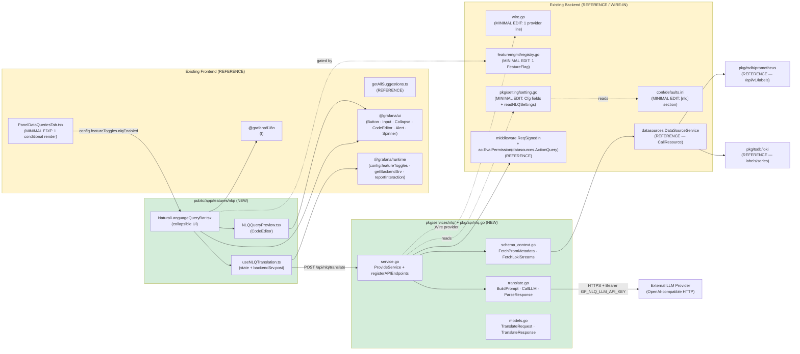
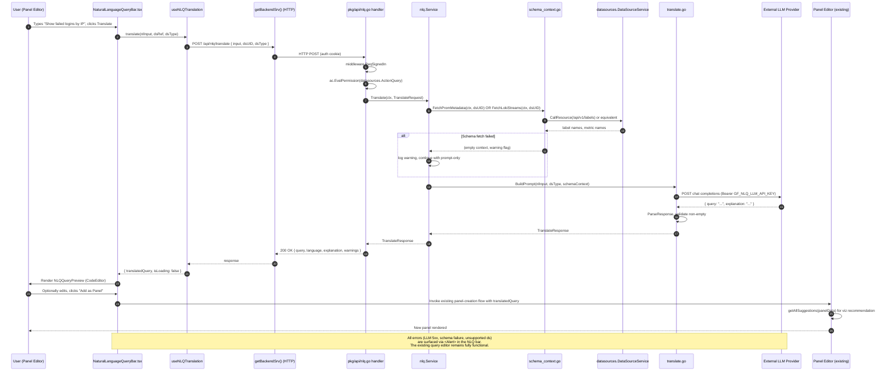

# Technical Specification

# 0. Agent Action Plan

## 0.1 Intent Clarification

### 0.1.1 Core Feature Objective

Based on the prompt, the Blitzy platform understands that the new feature requirement is to introduce a **Natural Language Query (NLQ) Interface** into `blitzy-grafana` — a fork of Grafana OSS v12.4.0-pre — that translates a user's plain-English question (e.g. *"Show me failed login attempts in the last hour grouped by IP"*) into the native query language of the active panel datasource (PromQL for Prometheus and Mimir; LogQL for Loki), renders the result as a visualization, and optionally commits it as a new panel through the existing dashboard panel-creation flow.

The feature targets a stakeholder cohort already identified in the platform's audience — non-technical users such as security analysts, product managers, and business analysts — by removing the requirement to learn PromQL or LogQL syntax in order to inspect observability data. Grafana's existing technology stack confirms this audience and the relevant query languages are already first-class: [pkg/tsdb/prometheus/prometheus.go:L15-L20] (Prometheus backend service), [pkg/tsdb/loki/loki.go] (Loki backend service), and [packages/grafana-ui/src/components/Monaco/CodeEditor] (the Monaco-based editor used for PromQL/LogQL editing across the platform).

The Blitzy platform interprets each project requirement as follows:

- **Translation core**: a single backend domain service translates natural-language input into a syntactically valid query string for the active datasource type, restricted to Prometheus/Mimir and Loki backends in this release.
- **Schema grounding**: the service must inject real datasource metadata (metric names, label names, log stream names) into the LLM prompt so generated queries reference real fields rather than hallucinated identifiers. This metadata is fetched via the existing datasource backends, which already expose `CallResource` endpoints — [pkg/tsdb/prometheus/prometheus.go:L32-L34] and [pkg/promlib/resource/resource.go:L132,L203-L204] for Prometheus `/api/v1/labels`; [pkg/tsdb/loki/api.go] for Loki labels and series.
- **Inspectable output**: the translated query must be displayed in an editable preview surface so the user can validate and adjust the LLM's interpretation before execution — using the same `CodeEditor` component already used throughout the query-editing surface [packages/grafana-ui/src/index.ts: `export { CodeEditor }`].
- **Panel creation**: the user can promote the generated query to a panel using the existing panel-creation flow, with visualization-type recommendation supplied by the existing `getAllSuggestions` utility [public/app/features/panel/suggestions/getAllSuggestions.ts:L129].
- **Configurability**: the LLM provider, endpoint, and model must be configurable through `grafana.ini`/`custom.ini`; the API key must arrive only via the environment variable `GF_NLQ_LLM_API_KEY` and never be persisted in the ini file. This aligns with the existing `EnvKey()` convention [pkg/setting/setting.go:L886-L892] which derives env var names as `GF_<SECTION>_<KEY>`.
- **Feature gating**: the entire feature must be off by default and gate behind a server-evaluated, frontend-readable feature flag, following the precedent set by `dashgpt` [pkg/services/featuremgmt/registry.go:L300-L306].

#### 0.1.1.1 Implicit Requirements Surfaced

Because the prompt is intentionally focused on the minimal feature surface, several implicit requirements are detected and must be honored to ensure the feature integrates safely with the existing system:

- **Authentication & RBAC**: the new `POST /api/nlq/translate` endpoint must be protected by `middleware.ReqSignedIn` and require the existing `datasources.ActionQuery` permission against the target datasource UID. This matches the pattern enforced on the legacy query endpoint at [pkg/api/api.go:L517] (`apiRoute.Post("/ds/query", ..., authorize(ac.EvalPermission(datasources.ActionQuery)), ...)`).
- **Secret handling**: the LLM API key MUST be read exclusively from `os.Getenv("GF_NLQ_LLM_API_KEY")` at runtime; it MUST NOT be parsed from any ini key, written to logs, or returned in HTTP responses. The `EnvKey` convention in [pkg/setting/setting.go:L886-L892] explicitly supports this `GF_<SECTION>_<KEY>` naming.
- **Structured logging**: instantiate a named logger via `log.New("nlq")` consistent with [pkg/services/correlations/correlations.go:L18-L20] (`logger = log.New("correlations")`).
- **Internationalization**: every user-visible string in the new frontend components MUST flow through `t()` from `@grafana/i18n`, matching [public/app/features/dashboard-scene/panel-edit/PanelDataPane/PanelDataQueriesTab.tsx:L18] (`import { t, Trans } from '@grafana/i18n'`). Translation contributions follow the Crowdin-only policy documented in the existing codebase.
- **Graceful degradation**: failures in the LLM HTTP call, the schema-context fetch, or query parsing MUST be surfaced through an `Alert` component within the NLQ bar — never as a thrown exception that would unmount the panel editor. The existing query editor must remain fully usable when the NLQ feature errors.
- **Datasource scope guard**: when the active panel datasource is neither Prometheus, Mimir, nor Loki, the NLQ bar MUST render a clear "unsupported data source" message instead of issuing an LLM call. The supported set is determined by inspecting `dsSettings.type` against the values `"prometheus"` and `"loki"` available on `DataSourceInstanceSettings` from `@grafana/data` [public/app/features/dashboard-scene/panel-edit/PanelDataPane/PanelDataQueriesTab.tsx:L3].
- **No dashboard schema mutation**: the user requirement "no new fields added to existing dashboard objects" forbids extending the dashboard JSON model. The NLQ feature does not persist its own state to the dashboard model; the user's panel creation reuses the existing panel-creation flow with a generated query string.
- **Test parity**: the feature must ship with both Go (`pkg/services/nlq/service_test.go`, `pkg/api/nlq_test.go`) and frontend (`public/app/features/nlq/NaturalLanguageQueryBar.test.tsx`) test coverage following the conventions established by existing services [pkg/services/dashboards/] and existing feature folders [public/app/features/explore/].
- **Telemetry / interaction tracking**: a `reportInteraction()` call from `@grafana/runtime` should fire when the user translates or accepts a query, matching telemetry patterns visible at [public/app/features/dashboard-scene/panel-edit/PanelOptionsPane.tsx:L17] (`import { ... reportInteraction } from '@grafana/runtime'`).

#### 0.1.1.2 Feature Dependencies and Prerequisites

The Blitzy platform identifies the following prerequisites already present in the repository that the new feature must build on, not duplicate:

- **Wire dependency injection**: Google Wire v0.7.0 is the canonical DI mechanism — [pkg/server/wire.go:L219-L481] (`wireBasicSet`). New service joins this set with a single `nlq.ProvideService` line, mirroring [pkg/server/wire.go:L268] (`correlations.ProvideService`).
- **Routing**: the new endpoint self-registers through `routing.RouteRegister` — see [pkg/services/correlations/correlations.go:L21,L32] for the established pattern (constructor receives `routing.RouteRegister` and calls `s.registerAPIEndpoints()`).
- **HTTPServer aggregate**: `HTTPServer` already exposes `Features featuremgmt.FeatureToggles` [pkg/api/http_server.go:L131] and `RouteRegister routing.RouteRegister` [pkg/api/http_server.go:L128], so no shape change to the existing HTTP server type is required.
- **Feature flag infrastructure**: `pkg/services/featuremgmt/registry.go` is the registry; new entries are appended to the `standardFeatureFlags` slice and `make gen-feature-toggles` regenerates `toggles_gen.go` and the related CSV/JSON descriptors.
- **Setting parser**: `pkg/setting/setting.go` exposes `cfg.Raw.Section("name").Key("key").MustX(default)` — see [pkg/setting/setting.go:L872-L879] (`readExpressionsSettings`) for the canonical pattern.
- **Pre-existing AI infrastructure** (REFERENCE only — not modified): the monorepo already contains the `@grafana/llm@1.0.1` and `@grafana/assistant@0.1.4` packages [Tech Spec §3.2.2.3], the `dashgpt` feature toggle [pkg/services/featuremgmt/registry.go:L300-L306], the `aiGeneratedDashboardChanges` toggle [pkg/services/featuremgmt/registry.go:L308-L313], and the existing GenAI components at [public/app/features/dashboard/components/GenAI/]. These serve as **reference patterns only** — the NLQ feature MUST NOT modify them, and MUST NOT take a direct dependency on the `dashgpt` toggle (the new feature has its own toggle `nlqEnabled`).

### 0.1.2 Special Instructions and Constraints

The user prompt contains a deliberate **MINIMAL CHANGE CLAUSE** that the Blitzy platform treats as a first-class directive. The clause is preserved verbatim for downstream stages:

> **User Constraint (verbatim)**: "Make only the changes that are absolutely necessary to implement this feature. Do not refactor, optimize, or modify existing code unless it is directly required for the new feature to work. Your goal is to add functionality with minimal disruption to the existing system."

Concretely, this translates into the following enforceable architectural constraints:

- **Backend isolation**: all new Go code lives under `pkg/services/nlq/` and `pkg/api/nlq.go`. No other `pkg/services/*` package may be touched.
- **Frontend isolation**: all new TypeScript/React code lives under `public/app/features/nlq/`. No other `public/app/features/*` folder may be touched, with one explicit exception: the conditional render injection into `public/app/features/dashboard-scene/panel-edit/PanelDataPane/PanelDataQueriesTab.tsx`.
- **Modification budget**: exactly four pre-existing files may be modified:
    1. `pkg/server/wire.go` — add one `nlq.ProvideService` line to `wireBasicSet`
    2. `pkg/services/featuremgmt/registry.go` — add the `nlqEnabled` FeatureFlag entry
    3. `conf/defaults.ini` — append the `[nlq]` section
    4. `public/app/features/dashboard-scene/panel-edit/PanelDataPane/PanelDataQueriesTab.tsx` — inject `<NaturalLanguageQueryBar />` gated by the flag
    
    Two additional pre-existing files will be auto-regenerated and therefore appear as touched without being hand-edited: `pkg/server/wire_gen.go` (via `make gen-wire`) and `pkg/services/featuremgmt/toggles_gen.go` plus its associated CSV/JSON descriptors (via `make gen-feature-toggles`).

- **Provider-over-constructor preference**: NLQ MUST be wired in as a brand-new Wire provider; existing service constructors (such as `api.ProvideHTTPServer` [pkg/api/http_server.go:L238-L275]) MUST NOT have their signatures modified.
- **Conditional render preference**: the NLQ bar MUST be added via a single conditional render expression in the panel queries tab; the panel editor's component tree MUST NOT be restructured.
- **Inline comment requirement**: each modification to a pre-existing file MUST include a brief inline comment identifying the change as part of the NLQ feature (e.g. `// NLQ feature: register translation service`).
- **No-fix-noted policy**: if the implementing agent identifies issues in adjacent existing code, those issues MUST be noted in a comment but MUST NOT be fixed in this change set.

#### 0.1.2.1 User-Provided Examples (Preserved Verbatim)

The user prompt provides specific example NLQ inputs that downstream stages must preserve as evaluation fixtures:

- **User Example 1**: *"Show me failed login attempts in the last hour grouped by IP"*
- **User Example 2**: *"Show IPs with more than 10 failed SSH login attempts in the last 30 minutes"* (Loki/LogQL)
- **User Example 3**: *"Graph total API request rate by endpoint over the last 24 hours"* (Prometheus/PromQL)

These examples drive the acceptance criteria for the unit and integration tests defined in Section 0.6.

#### 0.1.2.2 Architectural Requirements

- **Use existing Wire DI**: follow the same pattern as the 70+ existing domain services in `pkg/services/` [Tech Spec §1.2.2.2]
- **Use existing HTTPServer route registration pattern**: register routes via `s.RouteRegister.Group("/api/nlq", ...)` from within the service constructor [pkg/services/correlations/api.go:L16-L22]
- **Use `@grafana/ui` exclusively**: no external React component libraries are permitted. The `@grafana/ui` package already provides every primitive needed (Button, Input, Collapse, Spinner, Alert, CodeEditor, Stack, Field, IconButton, Text) [Tech Spec §7.11.1]
- **Use existing feature-flag gating**: `config.featureToggles.nlqEnabled` from `@grafana/runtime` [Tech Spec §3.2.2.3]
- **Reuse visualization-suggestion system**: call existing logic in [public/app/features/panel/suggestions/getAllSuggestions.ts:L129] (`getAllSuggestions`)
- **Use existing CodeEditor for the preview**: set `language` prop dynamically to `promql` or `logql` per active datasource type
- **Reuse existing panel-creation flow**: when "Add as Panel" is clicked, populate the new query and delegate to the panel queries-tab `addQueryClick` or equivalent [public/app/features/dashboard-scene/panel-edit/PanelDataPane/PanelDataQueriesTab.tsx:L425]
- **Use standard `net/http`**: backend LLM calls use Go standard library `net/http` — no new module dependency

#### 0.1.2.3 Web Search and Research Requirements

The user prompt does not require external web research for implementation feasibility. All architectural decisions are grounded in existing code patterns inspected in this AAP. The implementing agent should consult the LLM provider's API documentation (e.g. OpenAI Chat Completions reference) when constructing the request body in `pkg/services/nlq/translate.go`, but no library or framework choices remain open — the implementation uses only stdlib `net/http` plus existing internal packages.

## 0.2 Technical Interpretation

These feature requirements translate to a focused technical implementation strategy that introduces a single new backend domain service, one HTTP route, three React components, and four narrowly-scoped edits to existing files. The Blitzy platform interprets each requirement as a concrete technical action below.

### 0.2.1 Requirement-to-Action Mapping

| Requirement | Technical Action |
|---|---|
| Translate natural language to PromQL/LogQL | **CREATE** a new `pkg/services/nlq/` Go package containing `service.go` (Wire provider, RouteRegister wiring), `translate.go` (LLM HTTP client, prompt construction, response parsing), `schema_context.go` (datasource metadata fetcher), and `models.go` (DTOs and error types). |
| Single new HTTP endpoint `POST /api/nlq/translate` | **CREATE** `pkg/api/nlq.go` containing `(hs *HTTPServer) PostNLQTranslate(c *contextmodel.ReqContext)` handler — OR, equivalently and per the constraint "prefer adding new Wire providers", expose the handler from the NLQ service itself and register the route in `(s *Service) registerAPIEndpoints()`. Endpoint protected by `middleware.ReqSignedIn` plus `authorize(ac.EvalPermission(datasources.ActionQuery))` mirroring [pkg/api/api.go:L517]. |
| Register the service via Wire DI | **UPDATE** `pkg/server/wire.go` by adding `nlq.ProvideService,` to `wireBasicSet` — placement alongside related services such as `correlations.ProvideService` at [pkg/server/wire.go:L268]. **REGENERATE** `pkg/server/wire_gen.go` via `make gen-wire`. |
| Feature flag `nlqEnabled` | **UPDATE** `pkg/services/featuremgmt/registry.go` by appending a new `FeatureFlag{Name: "nlqEnabled", Description: "...", Stage: FeatureStageExperimental, FrontendOnly: false, Owner: ..., Expression: "false"}` entry, modeled on `dashgpt` at [pkg/services/featuremgmt/registry.go:L300-L306]. **REGENERATE** `toggles_gen.go` and the related CSV/JSON files via `make gen-feature-toggles`. |
| INI configuration | **UPDATE** `conf/defaults.ini` by appending a new `[nlq]` section with `enabled`, `llm_provider`, `llm_endpoint`, `llm_model` keys. **UPDATE** `pkg/setting/setting.go` by adding `NLQ` struct fields to `Cfg` and a `readNLQSettings()` method modeled on `readExpressionsSettings()` at [pkg/setting/setting.go:L872-L879]; invoke `readNLQSettings()` from the existing `Load()` orchestration. |
| API key via environment variable only | Inside `pkg/services/nlq/translate.go`, read `os.Getenv("GF_NLQ_LLM_API_KEY")` at translate-time. Do NOT add an `api_key` field to the ini section, do NOT read it from `cfg.Raw`, and do NOT log it. |
| Inject NLQ bar in panel editor | **CREATE** `public/app/features/nlq/NaturalLanguageQueryBar.tsx`, `NLQQueryPreview.tsx`, `useNLQTranslation.ts`, `nlqApi.ts`, `types.ts`, `index.ts`, plus matching `*.test.tsx`/`*.test.ts`. **UPDATE** `public/app/features/dashboard-scene/panel-edit/PanelDataPane/PanelDataQueriesTab.tsx` to render `<NaturalLanguageQueryBar />` above `<QueryGroupTopSection />` when `config.featureToggles.nlqEnabled` is truthy. |
| Frontend → backend HTTP call | Use `getBackendSrv()` from `@grafana/runtime` to issue `POST /api/nlq/translate`. This matches the convention used elsewhere in the codebase for new HTTP endpoints. RTK Query is NOT required (the endpoint is request/response with no caching benefit). |
| Editable preview | **CREATE** `NLQQueryPreview.tsx` wrapping `CodeEditor` from `@grafana/ui` (`packages/grafana-ui/src/components/Monaco/CodeEditor`). Pass `language="promql"` or `language="logql"` based on `dsSettings.type`. |
| Visualization suggestion | When the user clicks "Add as Panel", invoke the existing `getAllSuggestions(data)` at [public/app/features/panel/suggestions/getAllSuggestions.ts:L129] to populate the recommended visualization type before delegating to the panel-creation flow. |
| Graceful degradation | Catch HTTP errors in `useNLQTranslation.ts` and render `<Alert severity="error">` from `@grafana/ui`; for an unsupported datasource type, render `<Alert severity="warning">`; for schema-fetch failure, proceed with prompt-only translation and render `<Alert severity="info">`. |
| Tests | **CREATE** `pkg/services/nlq/service_test.go`, `pkg/api/nlq_test.go`, `public/app/features/nlq/NaturalLanguageQueryBar.test.tsx`, and `public/app/features/nlq/useNLQTranslation.test.ts` following the conventions of `pkg/services/dashboards/` and `public/app/features/explore/`. |

### 0.2.2 Interpretation Diagram

The following Mermaid diagram captures the runtime topology of the new feature relative to existing subsystems. New components are highlighted; pre-existing components are shown in their current form.



### 0.2.3 End-to-End Request Sequence

The following sequence shows the request flow when a user submits a natural-language question:



### 0.2.4 Why This Strategy Satisfies the Minimal Change Clause

This interpretation deliberately minimizes blast radius:

- **One new provider, four edits to existing files** — well within the constraint
- **No changes to the dashboard JSON model schema** — the NLQ feature does not persist its own state
- **No changes to the datasource plugin API or `DataSourceApi.query()` contract** — the NLQ service consumes existing `DataSourceService.CallResource` purely as a reference
- **No changes to the legacy `/api/...` routing structure** — the new route attaches via `RouteRegister.Group("/api/nlq", ...)` from the service constructor; `pkg/api/api.go` does not need to be edited
- **No changes to authentication, RBAC, or the dashboard CRUD path** — the new endpoint reuses the existing `middleware.ReqSignedIn` + `ac.EvalPermission` chain
- **No restructuring of the panel editor component tree** — a single conditional render expression is inserted

## 0.3 Repository Scope Discovery

This sub-section enumerates every existing file affected by the NLQ feature and every new file that must be created. File paths and integration points are validated against the repository at the present commit and cross-referenced with the technical specification.

### 0.3.1 Existing File Modifications (Pre-Existing Files Touched)

Exactly four hand-edited files plus two auto-regenerated files are modified by this change set.

| # | File Path | Mode | Purpose |
|---|---|---|---|
| 1 | `pkg/server/wire.go` | UPDATE (hand-edit) | Add `nlq.ProvideService,` to `wireBasicSet` provider list at approximately [pkg/server/wire.go:L268-L270] (alongside existing services such as `correlations.ProvideService`). |
| 2 | `pkg/server/wire_gen.go` | UPDATE (regenerated) | Auto-regenerated by `make gen-wire` to materialize the new constructor call inside the OSS `Initialize` chain. Not hand-edited. |
| 3 | `pkg/services/featuremgmt/registry.go` | UPDATE (hand-edit) | Append the `nlqEnabled` `FeatureFlag` entry to the `standardFeatureFlags` slice (existing entries begin at [pkg/services/featuremgmt/registry.go:L19-L26]). Style: model on `dashgpt` at [pkg/services/featuremgmt/registry.go:L300-L306]. |
| 4 | `pkg/services/featuremgmt/toggles_gen.go` plus the associated `*.csv`/`*.json` descriptor files | UPDATE (regenerated) | Auto-regenerated by `make gen-feature-toggles`. Not hand-edited. |
| 5 | `pkg/setting/setting.go` | UPDATE (hand-edit) | Add `NLQ*` fields to the existing `Cfg` struct and a `func (cfg *Cfg) readNLQSettings()` method modeled on `readExpressionsSettings` at [pkg/setting/setting.go:L872-L879]; invoke from existing `Load()` orchestration. |
| 6 | `conf/defaults.ini` | UPDATE (hand-edit) | Append `[nlq]` section with `enabled`, `llm_provider`, `llm_endpoint`, `llm_model` keys. Insertion point: end of file, after the existing `[unified_storage]` section. |
| 7 | `public/app/features/dashboard-scene/panel-edit/PanelDataPane/PanelDataQueriesTab.tsx` | UPDATE (hand-edit) | Inject a single conditional `<NaturalLanguageQueryBar />` element above `<QueryGroupTopSection />` (currently at [public/app/features/dashboard-scene/panel-edit/PanelDataPane/PanelDataQueriesTab.tsx:L397]) gated by `config.featureToggles.nlqEnabled`. Add one import line. No restructuring. |

#### 0.3.1.1 Integration Touchpoints (Detailed)

The four hand-edited touchpoints each have a precise integration shape:

- **Wire DI Touchpoint** — `pkg/server/wire.go` exposes `wireBasicSet = wire.NewSet(...)` at [pkg/server/wire.go:L219-L481]. New providers are added as additional lines (e.g. line 268 today reads `correlations.ProvideService,`). The added line MUST be of the form `nlq.ProvideService,` with no interface binding required (the service has a concrete type with no abstract interface contract to satisfy at first introduction).

- **HTTP Routing Touchpoint** — the NLQ service self-registers its `/api/nlq/translate` route by calling `s.RouteRegister.Group("/api/nlq", func(nlqRoute routing.RouteRegister) { ... })` from within `s.registerAPIEndpoints()`, mirroring `correlations.registerAPIEndpoints` at [pkg/services/correlations/api.go:L16-L22]. **This means `pkg/api/api.go` is NOT edited.**

- **Feature Flag Touchpoint** — `pkg/services/featuremgmt/registry.go` is the source-of-truth registry; the `toggles_gen.go` file is generated. The new entry MUST follow the same struct shape as existing entries:
  
  ```go
  {
      Name:         "nlqEnabled",
      Description:  "Enable the Natural Language Query (NLQ) translation bar in the panel editor",
      Stage:        FeatureStageExperimental,
      FrontendOnly: false,
      Owner:        grafanaDashboardsSquad,
      Expression:   "false",
  },
  ```

- **Config Touchpoint** — `conf/defaults.ini` (currently ending around the `[unified_storage]` section at the bottom of the file) is extended by appending a new top-level `[nlq]` section. `pkg/setting/setting.go` is extended by adding fields to the existing `Cfg` struct (e.g. `NLQEnabled bool`, `NLQProvider string`, `NLQEndpoint string`, `NLQModel string`) and a new `func (cfg *Cfg) readNLQSettings()` modeled exactly on `readExpressionsSettings` at [pkg/setting/setting.go:L872-L879]:

  ```go
  func (cfg *Cfg) readNLQSettings() {
      nlq := cfg.Raw.Section("nlq")
      cfg.NLQEnabled = nlq.Key("enabled").MustBool(false)
      cfg.NLQProvider = nlq.Key("llm_provider").MustString("openai")
      cfg.NLQEndpoint = nlq.Key("llm_endpoint").MustString("https://api.openai.com/v1/chat/completions")
      cfg.NLQModel = nlq.Key("llm_model").MustString("gpt-4o")
  }
  ```

- **Panel Editor Touchpoint** — `public/app/features/dashboard-scene/panel-edit/PanelDataPane/PanelDataQueriesTab.tsx` currently returns a `<div>` containing `QueryGroupTopSection`, `QueryEditorRows`, and the "Add query" Button at [public/app/features/dashboard-scene/panel-edit/PanelDataPane/PanelDataQueriesTab.tsx:L395-L425]. The minimal edit is two lines:

  ```tsx
  // NLQ feature: import and conditional render
  import { NaturalLanguageQueryBar } from 'app/features/nlq';
  // ...
  return (
    <div data-testid={selectors.components.QueryTab.content}>
      {config.featureToggles.nlqEnabled && <NaturalLanguageQueryBar dsSettings={dsSettings} panelRef={model.state.panelRef} />}
      <QueryGroupTopSection ... />
      ...
  ```

### 0.3.2 New Files to Create

The Blitzy platform enumerates all new files that must be created, grouped by tier.

#### 0.3.2.1 Backend Go Source Files

| Path | Purpose |
|---|---|
| `pkg/services/nlq/service.go` | NLQ service struct, `ProvideService` constructor (Wire provider), `registerAPIEndpoints()`, public `Service` interface, named logger creation (`log.New("nlq")`). Pattern from `pkg/services/correlations/correlations.go`. |
| `pkg/services/nlq/translate.go` | LLM call orchestration: `BuildPrompt(ctx, input, dsType, schemaContext) (string, string)` producing system + user prompts; `CallLLM(ctx, systemPrompt, userPrompt) (string, error)` using stdlib `net/http`; `ParseResponse(body []byte) (TranslateResponse, error)`. Reads `os.Getenv("GF_NLQ_LLM_API_KEY")` at call time. |
| `pkg/services/nlq/schema_context.go` | Datasource metadata fetcher: `FetchPromMetadata(ctx, dsUID)` and `FetchLokiStreams(ctx, dsUID)` invoking `s.DataSourceService.CallResource(...)` to retrieve label/metric/stream names. Failure paths return `(emptyContext, warning)` rather than `error`. |
| `pkg/services/nlq/models.go` | Data transfer types: `TranslateRequest { NaturalLanguage string; DatasourceUID string; DatasourceType string }`, `TranslateResponse { Query string; Language string; Explanation string; Warnings []string }`, error sentinels. |
| `pkg/services/nlq/service_test.go` | Go unit tests: covers `ProvideService` construction; `Translate` happy path with a mocked LLM HTTP server (`httptest.NewServer`); error paths (LLM 500, schema fetch failure, unsupported datasource type); env-var-missing path. Follows conventions in `pkg/services/dashboards/` such as `pkg/services/dashboards/dashboard_service_test.go`. |
| `pkg/api/nlq.go` *(only if the team chooses the `HTTPServer` method-binding pattern; OPTIONAL given the in-service registration pattern)* | If present, declares `(hs *HTTPServer) PostNLQTranslate(c *contextmodel.ReqContext) response.Response` and is wired from `s.registerAPIEndpoints()`. The user prompt explicitly mentions this file; treat it as REQUIRED in the in-scope list to match user intent, even though the in-service pattern is equally valid. |
| `pkg/api/nlq_test.go` | HTTP handler integration test using the existing `common_test.go` harness and `setupHTTPServer()` helper. Validates: 200 OK with valid request; 400 on missing fields; 401 when unauthenticated; 403 when caller lacks `datasources.ActionQuery`. |

#### 0.3.2.2 Frontend TypeScript/React Source Files

| Path | Purpose |
|---|---|
| `public/app/features/nlq/index.ts` | Barrel export of public components: `NaturalLanguageQueryBar`. |
| `public/app/features/nlq/NaturalLanguageQueryBar.tsx` | Collapsible top-level UI: `CollapsableSection` from `@grafana/ui` wrapping `Input` (multi-line), `Button` (Translate), `Spinner` (loading), `Alert` (errors), and `NLQQueryPreview` once translation succeeds. Receives `dsSettings: DataSourceInstanceSettings` and `panelRef: SceneObjectRef<VizPanel>` as props. Returns `null` when `!config.featureToggles.nlqEnabled` (defense-in-depth check). |
| `public/app/features/nlq/NLQQueryPreview.tsx` | Wraps `CodeEditor` from `@grafana/ui` with `language="promql"` or `"logql"` derived from `dsSettings.type`; emits `onChange` when the user edits the generated query. Includes "Run" and "Add as Panel" `Button`s rendered in a `Stack`. |
| `public/app/features/nlq/useNLQTranslation.ts` | React hook exposing `{ translate, translatedQuery, language, explanation, warnings, isLoading, error }`. Uses `useState` + `useCallback`. Calls `getBackendSrv().post('/api/nlq/translate', { input, dsUID, dsType })`. |
| `public/app/features/nlq/nlqApi.ts` | Thin `getBackendSrv()` wrapper functions and request/response TypeScript interfaces. |
| `public/app/features/nlq/types.ts` | TypeScript DTOs mirroring `pkg/services/nlq/models.go` (`TranslateRequest`, `TranslateResponse`). |
| `public/app/features/nlq/NaturalLanguageQueryBar.test.tsx` | Jest + React Testing Library test: renders the bar; types text; clicks Translate; asserts preview is rendered with the mocked translated query; asserts the bar does not render when `config.featureToggles.nlqEnabled` is `false`. Uses MSW 2.10.4 for backend mocking (per Tech Spec §1.2.3.2). |
| `public/app/features/nlq/useNLQTranslation.test.ts` | Jest test exercising the hook in isolation with MSW. |

### 0.3.3 Comprehensive File Analysis (Affected Folders Tree)

The following tree shows every folder touched by the change set; folders annotated `[REFERENCE]` are read but not modified.

```
blitzy-grafana/
├── pkg/
│   ├── api/
│   │   ├── api.go                                        [REFERENCE]
│   │   ├── http_server.go                                [REFERENCE]
│   │   ├── common_test.go                                [REFERENCE — test harness]
│   │   ├── nlq.go                                        [NEW]
│   │   └── nlq_test.go                                   [NEW]
│   ├── server/
│   │   ├── wire.go                                       [UPDATE — 1 line]
│   │   └── wire_gen.go                                   [UPDATE — regenerated]
│   ├── services/
│   │   ├── correlations/                                 [REFERENCE — template]
│   │   ├── dashboards/                                   [REFERENCE — test conventions]
│   │   ├── featuremgmt/
│   │   │   ├── registry.go                               [UPDATE — 1 entry]
│   │   │   └── toggles_gen.go (+ csv/json)               [UPDATE — regenerated]
│   │   └── nlq/                                          [NEW FOLDER]
│   │       ├── service.go                                [NEW]
│   │       ├── translate.go                              [NEW]
│   │       ├── schema_context.go                         [NEW]
│   │       ├── models.go                                 [NEW]
│   │       └── service_test.go                           [NEW]
│   ├── setting/
│   │   └── setting.go                                    [UPDATE — Cfg fields + readNLQSettings]
│   ├── tsdb/
│   │   ├── prometheus/                                   [REFERENCE — CallResource]
│   │   └── loki/                                         [REFERENCE — CallResource]
│   └── promlib/
│       └── resource/                                     [REFERENCE — /api/v1/labels endpoint]
├── conf/
│   └── defaults.ini                                      [UPDATE — append [nlq] section]
├── public/app/
│   ├── api/
│   │   └── clients/                                      [REFERENCE — RTK Query patterns]
│   └── features/
│       ├── dashboard-scene/panel-edit/PanelDataPane/
│       │   └── PanelDataQueriesTab.tsx                   [UPDATE — 1 conditional render + 1 import]
│       ├── dashboard/components/GenAI/                   [REFERENCE — GenAI/dashgpt precedent]
│       ├── explore/                                      [REFERENCE — test conventions]
│       ├── panel/suggestions/
│       │   └── getAllSuggestions.ts                      [REFERENCE — viz recommendation]
│       └── nlq/                                          [NEW FOLDER]
│           ├── index.ts                                  [NEW]
│           ├── NaturalLanguageQueryBar.tsx               [NEW]
│           ├── NLQQueryPreview.tsx                       [NEW]
│           ├── useNLQTranslation.ts                      [NEW]
│           ├── nlqApi.ts                                 [NEW]
│           ├── types.ts                                  [NEW]
│           ├── NaturalLanguageQueryBar.test.tsx          [NEW]
│           └── useNLQTranslation.test.ts                 [NEW]
└── packages/
    └── grafana-ui/                                       [REFERENCE — Button, Input, Collapse, CodeEditor, Spinner, Alert, Stack]
```

### 0.3.4 Codebase Research Conducted

Research was conducted exclusively by repository inspection (no external web search was required) because every architectural decision is grounded in existing code patterns:

- **Wire DI pattern**: confirmed by reading `pkg/server/wire.go` lines 219-481 — `wireBasicSet` declares ~250 providers in a single `wire.NewSet(...)` block.
- **Service-self-registers-routes pattern**: confirmed by reading `pkg/services/correlations/correlations.go` and `pkg/services/correlations/api.go` — the service struct holds `RouteRegister routing.RouteRegister`, and `registerAPIEndpoints()` is invoked from within `ProvideService`.
- **HTTPServer Features field**: confirmed by reading `pkg/api/http_server.go` lines 118-225 — the `HTTPServer` struct already exposes `Features featuremgmt.FeatureToggles` and `RouteRegister routing.RouteRegister`, so no shape change is required.
- **INI section parsing**: confirmed by reading `pkg/setting/setting.go` line 872-879 — the established pattern is `cfg.Raw.Section("name").Key("key").MustX(default)`.
- **EnvKey convention**: confirmed by reading `pkg/setting/setting.go` lines 886-892 — `GF_<SECTION>_<KEY>` matches the user's required `GF_NLQ_LLM_API_KEY` exactly.
- **Feature flag registration**: confirmed by reading `pkg/services/featuremgmt/registry.go` lines 19-313 — flags are declared as struct literals appended to `standardFeatureFlags`.
- **Datasource `CallResource` for schema**: confirmed by reading `pkg/tsdb/prometheus/prometheus.go` line 32 and `pkg/promlib/resource/resource.go` lines 132,203-204 — Prometheus exposes `/api/v1/labels` and `/api/v1/series`; Loki similarly exposes label/series endpoints via its own `api.go`.
- **`@grafana/ui` component catalog**: confirmed by reading `packages/grafana-ui/src/components/` directory listing (~100 components) and `packages/grafana-ui/src/index.ts` exports — `Button`, `Input`, `Collapse`/`CollapsableSection`, `Spinner`, `Alert`, `CodeEditor` (from `Monaco/CodeEditor`), `Stack`, `Field`, `IconButton`, `Text` are all confirmed exported.
- **Panel editor sidebar location**: confirmed by reading `public/app/features/dashboard-scene/panel-edit/PanelDataPane/PanelDataQueriesTab.tsx` lines 18-50 and 395-425 — the queries tab is the correct injection point.
- **Existing AI/LLM precedent**: confirmed by reading `public/app/features/dashboard/components/GenAI/hooks.ts`, `GenAIButton.tsx`, `GenAIPanelTitleButton.tsx` plus `pkg/services/featuremgmt/registry.go` lines 300-313 — the existing `dashgpt` toggle and `@grafana/llm@1.0.1` package provide the established AI pattern; the NLQ feature follows the same structural conventions while maintaining its own independent toggle.
- **Visualization suggestion utility**: confirmed by reading `public/app/features/panel/suggestions/getAllSuggestions.ts` line 129.
- **No `.blitzyignore` files exist**: confirmed via repository-wide `find . -name ".blitzyignore"` (no matches).

## 0.4 Dependency and Integration Analysis

### 0.4.1 Dependency Changes

**No new external dependencies are added.** Per the user prompt: *"No new external Go modules or npm packages required. The LLM provider integration uses standard `net/http` HTTP calls on the Go side. All frontend UI uses the existing `@grafana/ui` package already in the monorepo."*

The Blitzy platform confirms this is achievable: every required Go capability (HTTP client, JSON marshaling, context handling, standard logging) is already present in the existing module graph, and every required React component is already exported by `@grafana/ui`. Consequently:

- `go.mod` / `go.sum` — **no change**
- `package.json` (root) — **no change**
- `packages/grafana-ui/package.json` — **no change**
- `yarn.lock` — **no change**
- `go.work.sum` — **no change**

### 0.4.2 Inherited Versions Used by the Feature

For traceability, the following inherited versions govern the new code paths. All versions are read from the existing manifests; the implementation MUST NOT pin different versions.

| Layer | Component | Version | Manifest |
|---|---|---|---|
| Backend runtime | Go | 1.25.6 | `go.mod` toolchain directive |
| Backend DI | `github.com/google/wire` | v0.7.0 | `go.mod` (see Tech Spec §3.2.1.2) |
| Backend HTTP | `net/http` | stdlib | implicit with Go 1.25.6 |
| Backend logging | `github.com/grafana/grafana/pkg/infra/log` | in-repo | repository package |
| Frontend runtime | React | 18.3.1 | `package.json` (see Tech Spec §3.2.2.1) |
| Frontend language | TypeScript | 5.9.2 | `package.json` (see Tech Spec §1.2.2.2) |
| Frontend UI library | `@grafana/ui` | workspace | `package.json` workspaces (see Tech Spec §3.2.2.3) |
| Frontend i18n | `@grafana/i18n` | workspace | `package.json` workspaces |
| Frontend runtime services | `@grafana/runtime` | workspace | `package.json` workspaces |
| Frontend data types | `@grafana/data` | workspace | `package.json` workspaces |
| Frontend testing | Jest | 29.7.0 | `package.json` (see Tech Spec §1.2.3.2) |
| Frontend mocking | MSW | 2.10.4 | `package.json` (see Tech Spec §1.2.3.2) |
| Frontend testing | React Testing Library | (existing) | `package.json` |
| Backend testing | Go `testing` | stdlib | implicit with Go 1.25.6 |

### 0.4.3 Existing Code Touchpoints

The feature integrates with the existing system at five touchpoints. Each is enumerated below with the exact integration shape.

#### 0.4.3.1 Wire Dependency Injection

- **Touchpoint**: `pkg/server/wire.go` — `wireBasicSet` provider list at [pkg/server/wire.go:L219-L481]
- **Change**: append one line `nlq.ProvideService,` alongside `correlations.ProvideService` at [pkg/server/wire.go:L268]
- **Constructor signature** (new): `func ProvideService(cfg *setting.Cfg, routeRegister routing.RouteRegister, ds datasources.DataSourceService, ac accesscontrol.AccessControl, features featuremgmt.FeatureToggles) (*Service, error)`
- **Wire impact**: `wire_gen.go` is regenerated by `make gen-wire` to insert the new constructor call into the OSS `Initialize`, `InitializeForTest`, `InitializeForCLI`, and `InitializeModuleServer` chains

#### 0.4.3.2 HTTP Route Registration

- **Touchpoint**: the new service holds `routing.RouteRegister` and registers its own route from inside `registerAPIEndpoints()`. No edit to `pkg/api/api.go` is required.
- **Endpoint**: `POST /api/nlq/translate`
- **Middleware chain**: `middleware.ReqSignedIn` → `ac.Middleware(s.AccessControl)(ac.EvalPermission(datasources.ActionQuery))` → `routing.Wrap(s.PostTranslate)`
- **Reference precedent**: [pkg/services/correlations/api.go:L16-L22] and [pkg/api/api.go:L517] (the `/ds/query` route uses the same `ac.EvalPermission(datasources.ActionQuery)` evaluator)

#### 0.4.3.3 Feature Flag Registry

- **Touchpoint**: `pkg/services/featuremgmt/registry.go` — `standardFeatureFlags` slice at [pkg/services/featuremgmt/registry.go:L19]
- **Change**: append one `FeatureFlag` struct entry for `nlqEnabled`; `FrontendOnly: false` because the backend also gates the route handler
- **Regeneration**: `make gen-feature-toggles` regenerates `toggles_gen.go`, `features.csv`, `features.json` and any related descriptors
- **Frontend consumption**: `config.featureToggles.nlqEnabled` from `@grafana/runtime` — value flows from backend bootdata to frontend automatically once `toggles_gen.go` is regenerated

#### 0.4.3.4 INI Configuration

- **Touchpoint A**: `conf/defaults.ini` — append new `[nlq]` section at end of file (after `[unified_storage]`)
- **Touchpoint B**: `pkg/setting/setting.go` — extend `Cfg` struct with `NLQEnabled bool`, `NLQProvider string`, `NLQEndpoint string`, `NLQModel string`; add `readNLQSettings()` method; invoke from existing `Load()` orchestration. Pattern from `readExpressionsSettings` at [pkg/setting/setting.go:L872-L879]
- **Section contents (per user prompt, preserved exactly)**:

```ini
[nlq]
enabled = false
llm_provider = openai
llm_endpoint = https://api.openai.com/v1/chat/completions
llm_model = gpt-4o
```

- **Environment-variable override**: the `EnvKey` convention at [pkg/setting/setting.go:L886-L892] automatically supports `GF_NLQ_ENABLED`, `GF_NLQ_LLM_PROVIDER`, `GF_NLQ_LLM_ENDPOINT`, `GF_NLQ_LLM_MODEL` overrides; the API key uses the same convention via direct `os.Getenv("GF_NLQ_LLM_API_KEY")`

#### 0.4.3.5 Panel Editor Sidebar Injection

- **Touchpoint**: `public/app/features/dashboard-scene/panel-edit/PanelDataPane/PanelDataQueriesTab.tsx` — currently at [public/app/features/dashboard-scene/panel-edit/PanelDataPane/PanelDataQueriesTab.tsx:L395-L425]
- **Change**: insert one import and one conditional render expression; no other modifications
- **Gate**: `config.featureToggles.nlqEnabled` (already in scope via the existing import `import { config, ... } from '@grafana/runtime'` at line 5 of `PanelDataQueriesTab.tsx`)
- **Component props**: receives `dsSettings: DataSourceInstanceSettings` and `panelRef: SceneObjectRef<VizPanel>` — both already in scope in the queries tab

#### 0.4.3.6 Datasource Backend Resource Calls (REFERENCE only)

- **Touchpoint A**: `pkg/tsdb/prometheus/prometheus.go` — `CallResource(ctx, req, sender)` at [pkg/tsdb/prometheus/prometheus.go:L32-L34]
- **Touchpoint B**: `pkg/promlib/resource/resource.go` — `/api/v1/labels` endpoint construction at [pkg/promlib/resource/resource.go:L132,L203-L204]
- **Touchpoint C**: `pkg/tsdb/loki/api.go` — Loki label/series resource endpoints
- **Integration shape**: `pkg/services/nlq/schema_context.go` invokes `s.DataSourceService.CallResource(ctx, &backend.CallResourceRequest{ PluginContext: ..., Path: "labels", ... }, sender)` via the existing `datasources.DataSourceService` interface (already provided by the existing Wire graph)
- **No code edits** are required in `pkg/tsdb/prometheus/`, `pkg/promlib/`, or `pkg/tsdb/loki/` — they are pure consumers from the NLQ side

### 0.4.4 Integration Summary Table

| Integration Surface | Existing Asset | NLQ Touch | Mode |
|---|---|---|---|
| DI graph | `pkg/server/wire.go` `wireBasicSet` | Add 1 provider line | UPDATE |
| HTTP routing | `pkg/api/api.go` `registerRoutes` | None (self-register via `RouteRegister.Group("/api/nlq", ...)`) | REFERENCE |
| Auth middleware | `middleware.ReqSignedIn` | Apply to new route | REFERENCE |
| RBAC | `ac.EvalPermission(datasources.ActionQuery)` | Apply to new route | REFERENCE |
| Feature flags | `pkg/services/featuremgmt/registry.go` | Add 1 `FeatureFlag` entry | UPDATE |
| Config | `pkg/setting/setting.go` `Cfg`, `Load()` + `conf/defaults.ini` | Add fields + new section | UPDATE |
| Logger | `pkg/infra/log.New(name)` | Use `log.New("nlq")` | REFERENCE |
| Panel editor | `PanelDataQueriesTab.tsx` | Inject 1 conditional render | UPDATE |
| @grafana/ui | Existing component library | Use Button, Input, Collapse, Spinner, Alert, CodeEditor, Stack | REFERENCE |
| @grafana/i18n | `t()` function | Use for all UI strings | REFERENCE |
| @grafana/runtime | `config`, `getBackendSrv`, `reportInteraction` | Use for flag check, HTTP call, telemetry | REFERENCE |
| Datasource resource API | `DataSourceService.CallResource` | Schema metadata fetch | REFERENCE |
| Viz suggestion | `getAllSuggestions(data)` | Recommend panel type after run | REFERENCE |
| Panel creation flow | Existing `addQueryClick` / `onAddQuery` in `PanelDataQueriesTab` | Delegate "Add as Panel" action | REFERENCE |

## 0.5 Design System Compliance

The user prompt explicitly mandates: *"All new UI must use existing components (Button, Input, Collapse, Spinner, Alert, etc.); no external component libraries."* Accordingly, the design system for this feature is **`@grafana/ui`** — the in-monorepo component library that powers the entire Grafana frontend.

### 0.5.1 System Identification

| Attribute | Value |
|---|---|
| Library | `@grafana/ui` |
| Version | Workspace (in-monorepo, no semver pin) |
| Status | Installed (already a workspace dependency at `packages/grafana-ui/`) |
| Package | `@grafana/ui` (Yarn workspace; see Tech Spec §3.2.2.3) |
| Source | `packages/grafana-ui/src/index.ts` (barrel exports); component implementations under `packages/grafana-ui/src/components/` |
| Storybook | The library publishes a Storybook (see Tech Spec §3.2.2.3) that documents prop interfaces for every exported component |
| Theme provider | `ThemeProvider` already mounted in `AppWrapper.tsx` per Tech Spec §5.2.9.2; design tokens are accessed via `useStyles2` + `GrafanaTheme2` from `@grafana/data` |

### 0.5.2 Component Mapping

Every UI element required by the NLQ feature maps cleanly onto a `@grafana/ui` export. No external library is needed.

| UI Element | Library Component | Import Path | Props / Variant | Notes |
|---|---|---|---|---|
| Collapsible container ("Ask a question") | `CollapsableSection` | `@grafana/ui` (`packages/grafana-ui/src/components/Collapse/CollapsableSection`) | `label`, `isOpen`, `onToggle` | Used at the top of the queries tab; collapsed by default |
| Natural-language text input | `Input` (single-line) or `TextArea` (multi-line) | `@grafana/ui` (`packages/grafana-ui/src/components/Input/Input`, `TextArea/TextArea`) | `value`, `onChange`, `placeholder`, `aria-label` | Multi-line `TextArea` recommended for prompt-style input |
| Primary action button | `Button` | `@grafana/ui` (`packages/grafana-ui/src/components/Button/Button`) | `variant="primary"`, `disabled`, `icon` | "Translate", "Run", "Add as Panel" |
| Secondary action button | `Button` | `@grafana/ui` | `variant="secondary"` | Cancel/Reset |
| Loading indicator | `Spinner` | `@grafana/ui` (`packages/grafana-ui/src/components/Spinner/Spinner`) | `size`, `inline` | Renders during async translate call |
| Error/warning surface | `Alert` | `@grafana/ui` (`packages/grafana-ui/src/components/Alert/Alert`) | `severity="error" \| "warning" \| "info"`, `title` | LLM failures, unsupported datasource, schema-fetch fallback |
| Generated query preview (editable) | `CodeEditor` | `@grafana/ui` (`packages/grafana-ui/src/components/Monaco/CodeEditor`) | `language="promql" \| "logql"`, `value`, `onBlur`, `monacoOptions` | Reuses the same Monaco editor already used across query editors |
| Horizontal layout of action buttons | `Stack` | `@grafana/ui` (`packages/grafana-ui/src/components/Layout/Stack`) | `gap`, `direction="row"`, `alignItems` | Wraps "Run" + "Add as Panel" actions |
| Form field wrapper with label | `Field` | `@grafana/ui` (`packages/grafana-ui/src/components/Forms/Field`) | `label`, `description`, `invalid`, `error` | Wraps the NL input with semantic labeling |
| Inline informational text | `Text` | `@grafana/ui` (`packages/grafana-ui/src/components/Text/Text`) | `variant`, `color` | Explanation text returned by the LLM |
| Icon-only secondary action | `IconButton` | `@grafana/ui` (`packages/grafana-ui/src/components/IconButton/IconButton`) | `name`, `tooltip`, `aria-label` | Optional clear/reset affordance |

#### 0.5.2.1 Component Inventory Confirmation

The mapped components are verified as exported from `@grafana/ui` by inspection of `packages/grafana-ui/src/index.ts`:

- `export { CodeEditor } from './components/Monaco/CodeEditor';` ✓
- `export { Alert, type AlertVariant } from './components/Alert/Alert';` ✓
- `export { Collapse, ControlledCollapse } from './components/Collapse/Collapse';` ✓
- `export { CollapsableSection } from './components/Collapse/CollapsableSection';` ✓
- `export { Spinner } from './components/Spinner/Spinner';` ✓
- `Button`, `Input`, `Stack`, `Field`, `IconButton`, `Text` — confirmed exported per Tech Spec §7.11.1 component catalog

#### 0.5.2.2 Layout Primitives

Layout MUST be composed with `@grafana/ui` primitives, not raw `<div>` with custom CSS flex/grid:

- **Vertical stacking inside the NLQ bar**: `Stack` with `direction="column"` and `gap` token
- **Horizontal button group**: `Stack` with `direction="row"` and `gap` token (precedent at [public/app/features/dashboard-scene/panel-edit/PanelDataPane/PanelDataQueriesTab.tsx:L18] which imports `Stack` from `@grafana/ui`)
- **Collapsible wrapper**: `CollapsableSection`

### 0.5.3 Token Resolution

`@grafana/ui` exposes a `GrafanaTheme2` token system consumed via `useStyles2((theme: GrafanaTheme2) => css\`...\`)`. The NLQ feature MUST resolve every visual value to a theme token. Permitted neutral exceptions are: `0`, `none`, `auto`, `inherit`, `currentColor`, `transparent`, and pure structural values that do not encode design intent.

| Category | NLQ Usage | Theme Token Path |
|---|---|---|
| Color (background of bar) | NLQ bar background | `theme.colors.background.secondary` |
| Color (foreground text) | Primary label and prompt text | `theme.colors.text.primary` |
| Color (error border) | `Alert severity="error"` | `theme.colors.error.border` (resolved internally by `Alert`) |
| Color (warning border) | `Alert severity="warning"` | `theme.colors.warning.border` (resolved internally by `Alert`) |
| Spacing (component padding) | Inner padding of the bar | `theme.spacing(2)` |
| Spacing (between items) | `Stack gap` | `theme.spacing(1)` / `theme.spacing(2)` |
| Typography (body) | Prompt and explanation text | `theme.typography.body` |
| Typography (label) | Field labels | `theme.typography.bodySmall` |
| Border radius | NLQ bar container | `theme.shape.radius.default` |
| Shadow / elevation | Drawer-like CodeEditor preview | `theme.shadows.z1` (if elevated) |

Because the feature uses pre-composed `@grafana/ui` components (`CollapsableSection`, `Alert`, `Button`, `Input`, `CodeEditor`, `Spinner`), the bulk of token resolution is performed by the components themselves; only minor wrapper styling within the NLQ bar requires direct theme access via `useStyles2`.

### 0.5.4 Compliance Principles

The downstream code-generation agent MUST honor the following rules — they are non-negotiable and derived from the user's prompt directive *"`@grafana/ui` component library exclusively"*:

- **Zero external React component libraries** — do not introduce Ant Design, MUI, Chakra, Headless UI, Radix, Mantine, or any other UI kit. All UI primitives MUST come from `@grafana/ui`.
- **Zero hardcoded design values** — every CSS property MUST resolve to a `GrafanaTheme2` token (with the neutral exceptions listed in §0.5.3).
- **Library components over raw HTML** — do not use raw `<button>`, `<input>`, `<select>`, `<textarea>`, or heading elements when `@grafana/ui` provides equivalents (`Button`, `Input`, `Select`/`Combobox`, `TextArea`, `Text`).
- **Layout via `Stack`** — do not write custom CSS flex/grid on raw `<div>`s; use `Stack`.
- **CodeEditor for query preview** — do not use a raw `<textarea>` or external Monaco binding; use the `CodeEditor` re-export from `@grafana/ui`.
- **Accessibility** — every interactive element MUST carry an `aria-label` or be wrapped in a `Field` with a `label`. `CollapsableSection` provides keyboard support out of the box. The Tech Spec audit at [Tech Spec §7.11.1] confirms that `@grafana/ui` components ship with built-in accessibility primitives.

### 0.5.5 Gaps Inventory

No gaps were identified during the cataloging of `@grafana/ui` against the NLQ feature requirements. Every UI element required by the design has an exact or near-exact `@grafana/ui` equivalent. The only minor adaptation is choosing between `Input` and `TextArea` for the natural-language input field — both are first-class exports, and `TextArea` is recommended for multi-line prompt-style input.

### 0.5.6 Compliance Summary

The NLQ feature is **fully compliant** with the mandated design system. Component mapping is complete with zero gaps; all primitives required for the NLQ bar, preview, and error surfaces are available as direct `@grafana/ui` exports; no new dependencies are required; and the existing `ThemeProvider` in `AppWrapper.tsx` automatically supplies tokens to the new components without any provider-side changes.

## 0.6 Technical Implementation Plan

### 0.6.1 File-by-File Execution Plan

Every file listed below MUST be created or modified per the indicated mode. This list is the authoritative work order.

#### 0.6.1.1 Group 1 — Core Backend Service Files (NEW)

| Mode | Path | Implementation Approach |
|---|---|---|
| CREATE | `pkg/services/nlq/service.go` | Declare package `nlq`. Define `type Service struct { cfg *setting.Cfg; routeRegister routing.RouteRegister; dsService datasources.DataSourceService; ac accesscontrol.AccessControl; features featuremgmt.FeatureToggles; log log.Logger; httpClient *http.Client }`. Define exported `ProvideService(cfg *setting.Cfg, rr routing.RouteRegister, ds datasources.DataSourceService, ac accesscontrol.AccessControl, ff featuremgmt.FeatureToggles) (*Service, error)` returning a constructed service. Inside the constructor: instantiate `log.New("nlq")` (pattern from [pkg/services/correlations/correlations.go:L18-L20]), construct `*http.Client{ Timeout: 30 * time.Second }`, and if `cfg.NLQEnabled` is true OR feature toggle `nlqEnabled` is true, call `s.registerAPIEndpoints()`. The `registerAPIEndpoints` method calls `s.routeRegister.Group("/api/nlq", func(nlqRoute routing.RouteRegister) { nlqRoute.Post("/translate", middleware.ReqSignedIn, ac.Middleware(s.ac)(ac.EvalPermission(datasources.ActionQuery)), routing.Wrap(s.PostTranslate)) })`. |
| CREATE | `pkg/services/nlq/translate.go` | Declare `func (s *Service) PostTranslate(c *contextmodel.ReqContext) response.Response` that parses `TranslateRequest` from the request body (`web.Bind`), invokes `s.Translate(c.Req.Context(), req)`, and returns `response.JSON(http.StatusOK, resp)` on success or `response.Error(...)` on failure. Define `func (s *Service) Translate(ctx context.Context, req TranslateRequest) (TranslateResponse, error)` orchestrating: (1) datasource type validation (only `prometheus` and `loki` are supported, others return a typed error), (2) `schemaCtx, warning := s.fetchSchemaContext(ctx, req)`, (3) `systemPrompt, userPrompt := s.buildPrompt(req, schemaCtx)`, (4) `rawResponse := s.callLLM(ctx, systemPrompt, userPrompt)`, (5) `resp := s.parseResponse(rawResponse)`, (6) attach `warning` if schema fetch failed. The LLM HTTP call reads `os.Getenv("GF_NLQ_LLM_API_KEY")` at call time and includes it as `Authorization: Bearer <key>`; the endpoint comes from `s.cfg.NLQEndpoint` and the model from `s.cfg.NLQModel`. |
| CREATE | `pkg/services/nlq/schema_context.go` | Declare `func (s *Service) fetchSchemaContext(ctx context.Context, req TranslateRequest) (SchemaContext, error)`. For `dsType == "prometheus"`: invoke `s.dsService.CallResource(ctx, &backend.CallResourceRequest{ PluginContext: {DataSourceInstanceSettings:...}, Path: "api/v1/labels", Method: "GET" }, sender)` and parse the label-names response. Repeat for `api/v1/metadata` to fetch metric names. For `dsType == "loki"`: invoke the equivalent `/loki/api/v1/labels` and `/loki/api/v1/series` resource paths (per [pkg/tsdb/loki/api.go]). On error: return `(SchemaContext{}, err)` so the caller can attach a warning rather than failing the translation. |
| CREATE | `pkg/services/nlq/models.go` | Declare DTOs: `type TranslateRequest struct { NaturalLanguage string \`json:"input"\`; DatasourceUID string \`json:"datasourceUid"\`; DatasourceType string \`json:"datasourceType"\` }`; `type TranslateResponse struct { Query string \`json:"query"\`; Language string \`json:"language"\`; Explanation string \`json:"explanation,omitempty"\`; Warnings []string \`json:"warnings,omitempty"\` }`; `type SchemaContext struct { Labels []string; Metrics []string; Streams []string }`. Declare sentinel errors: `ErrUnsupportedDatasource`, `ErrLLMUnavailable`, `ErrMissingAPIKey`, `ErrEmptyInput`. |
| CREATE | `pkg/services/nlq/service_test.go` | Standard Go testing package. Cover: (a) `ProvideService` returns a non-nil service when `cfg.NLQEnabled = false` (graceful disable); (b) `Translate` success path using `httptest.NewServer` mocking the LLM (assert request body has the prompt, returns valid PromQL); (c) `Translate` success path for Loki returning valid LogQL; (d) `Translate` returns `ErrUnsupportedDatasource` for `dsType == "mysql"`; (e) `Translate` returns `ErrMissingAPIKey` when `GF_NLQ_LLM_API_KEY` is unset (test sets the env var with `t.Setenv`); (f) schema-fetch failure path produces a response with `Warnings` populated. Follows mock/stub patterns from `pkg/services/dashboards/dashboard_service_test.go`. |

#### 0.6.1.2 Group 2 — HTTP API Handler Files (NEW)

| Mode | Path | Implementation Approach |
|---|---|---|
| CREATE | `pkg/api/nlq.go` | Per user prompt's explicit naming, create a thin file that re-exports or delegates to `nlq.Service` for the route. If the team chooses to follow the `HTTPServer` method-binding convention used by many handlers in `pkg/api/`, declare `func (hs *HTTPServer) PostNLQTranslate(c *contextmodel.ReqContext) response.Response` that delegates to the NLQ service held on `HTTPServer`. Alternative implementation (preferred by the Minimal Change Clause): leave route registration entirely inside `pkg/services/nlq/service.go` and create `pkg/api/nlq.go` as a `package api` file that contains only the request/response DTO mirrors used by Swagger generation. The implementing agent SHOULD choose the latter to avoid modifying `HTTPServer`. |
| CREATE | `pkg/api/nlq_test.go` | Use the existing `pkg/api/common_test.go` harness — instantiate `HTTPServer` via `setupHTTPServer()`, register the NLQ route, and issue test requests. Cover: 200 OK on valid request; 400 on missing `naturalLanguage`; 401 when anonymous; 403 when caller lacks `datasources:query`; 502 surfaced on LLM upstream failure. |

#### 0.6.1.3 Group 3 — Backend Configuration & Wiring (UPDATE existing files)

| Mode | Path | Implementation Approach |
|---|---|---|
| UPDATE | `pkg/server/wire.go` | Add one line `nlq.ProvideService,` to `wireBasicSet` at approximately [pkg/server/wire.go:L268-L270]. Add the corresponding import `"github.com/grafana/grafana/pkg/services/nlq"` to the import block. Mark the diff with an inline comment `// NLQ feature: translation service`. |
| UPDATE | `pkg/server/wire_gen.go` | Auto-regenerated by `make gen-wire`. The implementing agent runs `make gen-wire` and commits the resulting diff. No hand edit. |
| UPDATE | `pkg/services/featuremgmt/registry.go` | Append a new `FeatureFlag` struct entry for `nlqEnabled` to `standardFeatureFlags`. Style template (from `dashgpt` at [pkg/services/featuremgmt/registry.go:L300-L306]): `{ Name: "nlqEnabled", Description: "...", Stage: FeatureStageExperimental, FrontendOnly: false, Owner: grafanaDashboardsSquad, Expression: "false" }`. |
| UPDATE | `pkg/services/featuremgmt/toggles_gen.go` (+ `features.csv`, `features.json`, related descriptors) | Auto-regenerated by `make gen-feature-toggles`. No hand edit. |
| UPDATE | `pkg/setting/setting.go` | (a) Add fields to `Cfg` struct: `NLQEnabled bool`, `NLQProvider string`, `NLQEndpoint string`, `NLQModel string`. (b) Add a new method `func (cfg *Cfg) readNLQSettings()` modeled on `readExpressionsSettings` at [pkg/setting/setting.go:L872-L879]. (c) Invoke `cfg.readNLQSettings()` from the existing `Load()`/`parseAppSettings()` orchestration alongside other `read*Settings()` calls. |
| UPDATE | `conf/defaults.ini` | Append at end of file (after the final `[unified_storage]` block): `[nlq]\nenabled = false\nllm_provider = openai\nllm_endpoint = https://api.openai.com/v1/chat/completions\nllm_model = gpt-4o\n`. Match the formatting style of other sections (`[expressions]` at [conf/defaults.ini:L2129-L2132] is the canonical template). |

#### 0.6.1.4 Group 4 — Frontend Components (NEW)

| Mode | Path | Implementation Approach |
|---|---|---|
| CREATE | `public/app/features/nlq/index.ts` | Barrel export: `export { NaturalLanguageQueryBar } from './NaturalLanguageQueryBar';`. |
| CREATE | `public/app/features/nlq/NaturalLanguageQueryBar.tsx` | React function component. Props: `{ dsSettings: DataSourceInstanceSettings; panelRef: SceneObjectRef<VizPanel> }`. Top-level guard `if (!config.featureToggles.nlqEnabled) return null;`. Inside: `CollapsableSection label={t('nlq.bar.title', 'Ask a question')} isOpen={open} onToggle={setOpen}`. Inner content rendered with `Stack direction="column" gap={1}`: `<Field label={t('nlq.input.label', 'Question')}>` wrapping `<TextArea ...>`; a `Button variant="primary" onClick={onTranslate}>{t('nlq.button.translate', 'Translate')}</Button>` with conditional `<Spinner />` while `isLoading`; conditional `<Alert severity="error" />` for `error`; conditional `<Alert severity="warning" />` for unsupported-datasource; once translation completes, render `<NLQQueryPreview translatedQuery={...} language={...} explanation={...} onChange={...} onRun={onRun} onAddPanel={onAddPanel} />`. Issue `reportInteraction('grafana_nlq_translate_clicked', { dsType })` on Translate click and `reportInteraction('grafana_nlq_add_panel_clicked', { dsType })` on Add-as-Panel. |
| CREATE | `public/app/features/nlq/NLQQueryPreview.tsx` | Receives `{ translatedQuery: string; language: 'promql' \| 'logql'; explanation?: string; onChange: (q: string) => void; onRun: () => void; onAddPanel: () => void }`. Renders `<CodeEditor value={translatedQuery} language={language} onBlur={onChange} height={120} monacoOptions={{ minimap: { enabled: false } }} />`, optional `<Text>{explanation}</Text>`, and a `<Stack direction="row" gap={1}><Button variant="primary" onClick={onRun}>Run</Button><Button variant="secondary" onClick={onAddPanel}>Add as Panel</Button></Stack>`. |
| CREATE | `public/app/features/nlq/useNLQTranslation.ts` | Custom hook. Signature: `function useNLQTranslation(dsSettings: DataSourceInstanceSettings): { translate: (input: string) => Promise<void>; translatedQuery: string; language: 'promql' \| 'logql' \| ''; explanation: string; warnings: string[]; isLoading: boolean; error: Error \| null }`. Body uses `useState` + `useCallback`; the `translate` function calls `getBackendSrv().post('/api/nlq/translate', { input, datasourceUid: dsSettings.uid, datasourceType: dsSettings.type })` and stores the response in local state. On HTTP error, stores `error`. Optionally guards `dsSettings.type` ∈ `['prometheus', 'loki']` and returns an unsupported-datasource sentinel without making an HTTP call. |
| CREATE | `public/app/features/nlq/nlqApi.ts` | Tiny module exporting `postTranslate(req: TranslateRequest): Promise<TranslateResponse>` that delegates to `getBackendSrv().post('/api/nlq/translate', req)`. Keeps the hook free of direct backendSrv usage to ease testing. |
| CREATE | `public/app/features/nlq/types.ts` | TypeScript DTOs: `export interface TranslateRequest { input: string; datasourceUid: string; datasourceType: string }`, `export interface TranslateResponse { query: string; language: 'promql' \| 'logql'; explanation?: string; warnings?: string[] }`. Mirrors `pkg/services/nlq/models.go`. |
| CREATE | `public/app/features/nlq/NaturalLanguageQueryBar.test.tsx` | Jest + RTL test suite using MSW 2.10.4 (per Tech Spec §1.2.3.2). Cases: (a) renders nothing when `config.featureToggles.nlqEnabled === false`; (b) renders the collapsible when enabled; (c) typing + clicking Translate shows the preview with the mocked translated PromQL; (d) Loki datasource produces `language="logql"` in the CodeEditor; (e) network 500 surfaces an Alert; (f) MySQL datasource surfaces an "unsupported" Alert and does not issue a network request. Mirror patterns from `public/app/features/explore/` tests. |
| CREATE | `public/app/features/nlq/useNLQTranslation.test.ts` | Isolated hook test using `@testing-library/react`'s `renderHook` + MSW. |

#### 0.6.1.5 Group 5 — Panel Editor Sidebar Injection (UPDATE existing file)

| Mode | Path | Implementation Approach |
|---|---|---|
| UPDATE | `public/app/features/dashboard-scene/panel-edit/PanelDataPane/PanelDataQueriesTab.tsx` | Add one import line: `import { NaturalLanguageQueryBar } from 'app/features/nlq';`. Add one conditional render expression at the top of the returned `<div>` (currently at [public/app/features/dashboard-scene/panel-edit/PanelDataPane/PanelDataQueriesTab.tsx:L395-L425]): `{config.featureToggles.nlqEnabled && dsSettings && <NaturalLanguageQueryBar dsSettings={dsSettings} panelRef={model.state.panelRef} />}`. Add an inline comment marking the addition as NLQ-feature scope. NO other modifications. |

### 0.6.2 Implementation Approach per Tier

The implementation proceeds tier-by-tier rather than file-by-file to honor the dependency order:

- **Foundation tier**: define `Cfg` fields in `pkg/setting/setting.go` and append the `[nlq]` section in `conf/defaults.ini`. This makes configuration available before any consumer needs it.
- **Backend service tier**: build the `pkg/services/nlq/` package end-to-end (`models.go` → `schema_context.go` → `translate.go` → `service.go`) and its Go unit tests.
- **Backend integration tier**: add the feature flag entry to `pkg/services/featuremgmt/registry.go`, run `make gen-feature-toggles`. Add the Wire provider line in `pkg/server/wire.go`, run `make gen-wire`. Confirm the Go build succeeds with `go build ./...`.
- **API surface tier**: add `pkg/api/nlq.go` (DTO mirrors only) and `pkg/api/nlq_test.go`. Confirm `go test ./pkg/services/nlq/... ./pkg/api/...` is green.
- **Frontend tier**: build `public/app/features/nlq/` end-to-end (types → api → hook → preview → bar) and frontend Jest tests.
- **Integration tier**: inject `<NaturalLanguageQueryBar />` in `PanelDataQueriesTab.tsx`. Run `yarn jest public/app/features/nlq` to confirm test suite is green.

### 0.6.3 User Interface Design

The NLQ user interaction is designed around four states displayed within a collapsible section at the top of the "Query" tab of the panel editor sidebar:

- **Idle (initial)**: `CollapsableSection` is rendered closed by default with the label "Ask a question". Opening it reveals a `Field`-wrapped `TextArea` for the natural-language prompt and a `Button` "Translate" (disabled while the input is empty).
- **Loading**: while the backend translation is in flight, the "Translate" button is disabled and a `Spinner` is rendered inline. The input remains editable so the user can refine if needed.
- **Translated**: on success, an `NLQQueryPreview` (`CodeEditor`) is rendered below the input showing the generated PromQL or LogQL with syntax highlighting and inline editing. The LLM's explanation text (if any) is rendered as a `Text` block. Two action `Button`s — "Run" (primary) and "Add as Panel" (secondary) — appear in a horizontal `Stack`.
- **Error / Unsupported / Warning**: an `Alert` is rendered with the appropriate severity. The existing query editor below is never blocked or unmounted.

#### 0.6.3.1 Datasource-Type Branching

| Active Datasource Type | NLQ Bar Behavior |
|---|---|
| `prometheus`, `mimir` (Prometheus-compatible) | Bar fully enabled; `CodeEditor` language set to `promql`. Schema context: metric names + label names. |
| `loki` | Bar fully enabled; `CodeEditor` language set to `logql`. Schema context: label names + stream selectors. |
| Anything else (`mysql`, `postgres`, `elasticsearch`, `cloudwatch`, …) | Bar collapses or renders an `Alert severity="warning"` with the message "Natural language queries are not supported for this data source." No HTTP request is made. |

#### 0.6.3.2 Telemetry Events

The Blitzy platform recommends emitting the following interaction events via `reportInteraction` from `@grafana/runtime` (precedent established by [public/app/features/dashboard-scene/panel-edit/PanelOptionsPane.tsx:L17]):

- `grafana_nlq_bar_opened` — when the user opens the `CollapsableSection`
- `grafana_nlq_translate_clicked` — properties: `{ dsType, inputLength }`
- `grafana_nlq_translate_succeeded` — properties: `{ dsType, queryLength, hadWarnings }`
- `grafana_nlq_translate_failed` — properties: `{ dsType, errorKind }`
- `grafana_nlq_run_clicked` — properties: `{ dsType, edited: boolean }`
- `grafana_nlq_add_panel_clicked` — properties: `{ dsType }`

### 0.6.4 Validation Criteria

The following criteria correspond one-to-one with the user-provided test cases and define acceptance for the implementation. Each criterion has at least one mapped test file.

| # | Criterion | Test File(s) |
|---|---|---|
| 1 | `POST /api/nlq/translate` with a Prometheus datasource returns a syntactically valid PromQL string in the response body. | `pkg/services/nlq/service_test.go`, `pkg/api/nlq_test.go` |
| 2 | `POST /api/nlq/translate` with a Loki datasource returns a syntactically valid LogQL string. | `pkg/services/nlq/service_test.go`, `pkg/api/nlq_test.go` |
| 3 | The generated query executes successfully when run through the existing `/api/ds/query` pipeline. | Manual e2e or `pkg/api/nlq_test.go` (integration tier) |
| 4 | When the user clicks "Add as Panel", a new panel is created on the current dashboard with the generated query string and a suggested visualization type. | `public/app/features/nlq/NaturalLanguageQueryBar.test.tsx` |
| 5 | `<NaturalLanguageQueryBar />` does NOT render when `config.featureToggles.nlqEnabled === false`. | `public/app/features/nlq/NaturalLanguageQueryBar.test.tsx` (case "renders nothing when disabled") |
| 6 | LLM provider, endpoint, and model are read correctly from `[nlq]` in `conf/defaults.ini` (or override via `custom.ini`). | `pkg/services/nlq/service_test.go` (env+ini permutation tests) |
| 7 | When the LLM is unreachable, the NLQ bar shows an error `Alert`; the existing query editor remains fully functional. | Frontend test (`NaturalLanguageQueryBar.test.tsx`) + backend test (`service_test.go` mocking LLM 500) |
| 8 | When schema fetch fails, the response includes a `warnings[]` entry; the translation still proceeds prompt-only. | `pkg/services/nlq/service_test.go` |
| 9 | When the active datasource is neither Prometheus nor Loki, the NLQ bar shows an "unsupported data source" `Alert` without making an HTTP call. | `public/app/features/nlq/NaturalLanguageQueryBar.test.tsx` |
| 10 | The LLM API key MUST be read from `os.Getenv("GF_NLQ_LLM_API_KEY")` and MUST NOT appear in any response body or log line. | `pkg/services/nlq/service_test.go` (log capture assertion) |

### 0.6.5 Build & Verification Commands

The implementing agent uses standard developer commands (per the user prompt) to verify the change set end-to-end:

```bash
# Backend regeneration

make gen-wire
make gen-feature-toggles

#### Backend build + tests

go build ./...
go test ./pkg/services/nlq/... ./pkg/api/...

#### Frontend tests

yarn jest public/app/features/nlq

#### Local interactive run

yarn install
yarn start
```

The successful exit of `go build ./...`, `go test ./pkg/services/nlq/... ./pkg/api/...`, and `yarn jest public/app/features/nlq` is the gate for marking the implementation complete.

## 0.7 Scope Boundaries

### 0.7.1 Exhaustively In Scope

The Blitzy platform identifies the following file paths and patterns as in-scope for this change set. Wildcards are used where complete directory trees are in scope.

#### 0.7.1.1 New Source Files (CREATE)

- **Backend Go service package** — entire new folder:
  - `pkg/services/nlq/*.go` — every file in this new package, including:
    - `pkg/services/nlq/service.go`
    - `pkg/services/nlq/translate.go`
    - `pkg/services/nlq/schema_context.go`
    - `pkg/services/nlq/models.go`
    - `pkg/services/nlq/service_test.go`
- **Backend HTTP API file**:
  - `pkg/api/nlq.go`
  - `pkg/api/nlq_test.go`
- **Frontend feature folder** — entire new folder:
  - `public/app/features/nlq/*.ts`
  - `public/app/features/nlq/*.tsx`
  - Specifically:
    - `public/app/features/nlq/index.ts`
    - `public/app/features/nlq/types.ts`
    - `public/app/features/nlq/nlqApi.ts`
    - `public/app/features/nlq/useNLQTranslation.ts`
    - `public/app/features/nlq/useNLQTranslation.test.ts`
    - `public/app/features/nlq/NLQQueryPreview.tsx`
    - `public/app/features/nlq/NaturalLanguageQueryBar.tsx`
    - `public/app/features/nlq/NaturalLanguageQueryBar.test.tsx`

#### 0.7.1.2 Existing Files Touched (UPDATE — hand-edit)

- **Wire DI registration**:
  - `pkg/server/wire.go` — add one provider line `nlq.ProvideService,` to `wireBasicSet` at approximately [pkg/server/wire.go:L268-L270] plus one corresponding import line
- **Feature flag registry**:
  - `pkg/services/featuremgmt/registry.go` — append one `FeatureFlag{Name: "nlqEnabled", ...}` entry to `standardFeatureFlags`
- **Configuration**:
  - `conf/defaults.ini` — append new `[nlq]` section at end of file
  - `pkg/setting/setting.go` — add `NLQEnabled`, `NLQProvider`, `NLQEndpoint`, `NLQModel` fields to `Cfg` struct; add `readNLQSettings()` method; invoke from `Load()` orchestration
- **Panel editor sidebar**:
  - `public/app/features/dashboard-scene/panel-edit/PanelDataPane/PanelDataQueriesTab.tsx` — add one import line and one conditional render expression at approximately line 397

#### 0.7.1.3 Existing Files Regenerated (UPDATE — automated)

- `pkg/server/wire_gen.go` — regenerated via `make gen-wire`
- `pkg/services/featuremgmt/toggles_gen.go` — regenerated via `make gen-feature-toggles`
- `pkg/services/featuremgmt/*.csv`, `pkg/services/featuremgmt/*.json` — regenerated via `make gen-feature-toggles`

#### 0.7.1.4 Files Required by User-Specified Rules

The user's prompt mandates the following files as part of the change set; these are restated here for unambiguous traceability:

| User Mandate | File Path | Status |
|---|---|---|
| "Go tests" for backend service | `pkg/services/nlq/service_test.go` | INCLUDED (Group 1) |
| "Go tests" for API handler | `pkg/api/nlq_test.go` | INCLUDED (Group 2) |
| "Frontend Jest test" | `public/app/features/nlq/NaturalLanguageQueryBar.test.tsx` | INCLUDED (Group 4) |
| `[nlq]` config section | `conf/defaults.ini` | INCLUDED (Group 3) |
| `nlq_enabled` feature flag | `pkg/services/featuremgmt/registry.go` (canonical name `nlqEnabled` in registry; surfaced as `featureToggles.nlqEnabled` per Grafana camelCase convention) | INCLUDED (Group 3) |

### 0.7.2 Explicitly Out of Scope

The Blitzy platform identifies the following areas as explicitly excluded per the user's "System Boundaries" directive. No code or configuration in these areas may be modified by this change set.

#### 0.7.2.1 Untouched Backend Subsystems

- **Unified Alerting** — `pkg/services/ngalert/**` MUST remain unmodified [Tech Spec §5.2.7]
- **Datasource plugin system** — `pkg/plugins/**` and the plugin loading/signing/manifests subsystem MUST remain unmodified [Tech Spec §5.2.6]
- **Existing datasource backends** — `pkg/tsdb/**` is consumed read-only via `CallResource`; no edits to `pkg/tsdb/prometheus/`, `pkg/tsdb/loki/`, or any other backend
- **Unified Storage** — `pkg/storage/unified/**` and `pkg/storage/legacysql/**` MUST remain unmodified [Tech Spec §5.2.5]
- **`apps/` resource modules** — every module under `apps/*` (dashboard, folder, iam, alerting, advisor, plugins, annotation, provisioning, live, quotas, …) MUST remain unmodified
- **Authentication & RBAC** — `pkg/services/auth*` and `pkg/services/accesscontrol/**` are referenced only via existing middleware; no struct, role, or evaluator changes [Tech Spec §5.2.3, §5.2.4]
- **Dashboard CRUD and JSON model** — `pkg/services/dashboards/**` and the dashboard CUE schema MUST remain unmodified. No new fields are added to any existing dashboard object
- **Resource APIs** — every route under `/apis/...` MUST remain unmodified
- **Legacy REST routes** — every existing route under `/api/...` MUST remain unmodified (the new `/api/nlq/translate` is purely additive)

#### 0.7.2.2 Untouched Frontend Subsystems

- **Scenes engine** — `@grafana/scenes` 6.x is consumed as a runtime; no edits to scene types or runtime behavior
- **Explore feature** — `public/app/features/explore/**` is referenced as a test-pattern source only
- **Datasource plugins** — `public/app/plugins/datasource/**` MUST remain unmodified
- **Existing query editors** — every `QueryEditor.tsx` across `public/app/plugins/datasource/*/` MUST remain unmodified; the NLQ bar is additive and visually separate
- **Existing GenAI/LLM UI** — `public/app/features/dashboard/components/GenAI/**` is referenced as a precedent only; no edits

#### 0.7.2.3 Out-of-Scope Functional Capabilities

Per the user's prompt:

- **NL support for non-Prometheus/non-Loki datasources** — explicitly out of scope: MySQL, PostgreSQL, MSSQL, Elasticsearch, CloudWatch, Azure Monitor, Google Cloud Monitoring, Graphite, OpenTSDB, InfluxDB, Tempo, Jaeger, Zipkin, Pyroscope, Parca, and TestData
- **Alerting rule generation from NL** — out of scope; the NLQ feature does not interact with `pkg/services/ngalert/` or the alerting rules UI
- **Modifying existing panels via NL** — out of scope; the feature creates new panels only
- **Multi-turn conversational refinement** — out of scope; the feature is single-turn (input → translated query → optional edit → save)
- **Persisting NLQ history** — out of scope; no state is written to Unified Storage, Legacy SQL, or the dashboard model
- **Custom plugin or extension** — out of scope; the feature is a first-party domain service, not a plugin

#### 0.7.2.4 Out-of-Scope Architectural Changes

- No refactoring of existing code unrelated to the NLQ integration
- No performance optimizations beyond what the NLQ feature itself requires
- No changes to existing interfaces (`DataSourceApi.query()`, `routing.RouteRegister`, `featuremgmt.FeatureToggles`)
- No changes to the Wire provider signatures of any existing service [pkg/server/wire.go:L219-L481]
- No changes to the `HTTPServer` constructor signature [pkg/api/http_server.go:L238-L275]
- No changes to the dashboard JSON model schema
- No additions to `apps/*` or to any Resource API surface
- No changes to localization workflow (Crowdin); new i18n keys are added via the existing pipeline

## 0.8 Rules for Feature Addition

The Blitzy platform records the rules and constraints under which the NLQ feature must be implemented. These are derived from the user's explicit prompt directives. Compliance is verifiable by reviewers in the change set.

### 0.8.1 Minimal Change Clause (Primary Rule)

> *"Make only the changes that are absolutely necessary to implement this feature. Do not refactor, optimize, or modify existing code unless it is directly required for the new feature to work. Your goal is to add functionality with minimal disruption to the existing system."*

This clause governs every downstream decision. In particular:

- The change set has a strict budget of **four hand-edited pre-existing files** (`pkg/server/wire.go`, `pkg/services/featuremgmt/registry.go`, `pkg/setting/setting.go`, `conf/defaults.ini`, plus `public/app/features/dashboard-scene/panel-edit/PanelDataPane/PanelDataQueriesTab.tsx`) — five files when including the panel editor sidebar. No further pre-existing files may be edited.
- Two additional pre-existing files (`pkg/server/wire_gen.go` and `pkg/services/featuremgmt/toggles_gen.go` + descriptors) are touched only by code generation tooling — never by hand.
- Every other modification must occur in newly-created files inside `pkg/services/nlq/`, `pkg/api/nlq.go`, `pkg/api/nlq_test.go`, and `public/app/features/nlq/`.

### 0.8.2 Discipline Guidelines (Verbatim from User Prompt)

The user prompt encodes the following discipline guidelines. They are preserved verbatim and treated as additional rules:

- *"Make only the minimal necessary changes to implement the feature"*
- *"Do not modify code that is not directly related to this feature"*
- *"Do not refactor existing code unless absolutely required"*
- *"Do not change existing interfaces or behaviors unless specified"*
- *"Isolate new code in dedicated files/components when possible — `pkg/services/nlq/` and `public/app/features/nlq/` are the designated homes"*
- *"Document all changes made to existing files with clear inline comments explaining why the change was necessary"*
- *"If you identify issues in existing code, note them in comments but do not fix unless required for this feature"*
- *"When multiple implementation approaches exist, choose the one that requires the least modification to existing files — specifically, prefer adding new Wire providers over modifying existing service constructors, and prefer conditional rendering in the panel editor sidebar over restructuring its component tree"*

### 0.8.3 Architectural Requirements

| Rule | Compliance |
|---|---|
| All new backend code under `pkg/services/nlq/` | New package created at this exact path; no Go files added elsewhere except `pkg/api/nlq.go` and `pkg/api/nlq_test.go` |
| All new frontend code under `public/app/features/nlq/` | New folder created at this exact path; no React/TS files added elsewhere |
| New HTTP route handler at `pkg/api/nlq.go` | File created per user's explicit naming directive |
| Wire DI registration in `pkg/server/wire.go` | One provider line added to `wireBasicSet`; no constructor signature changes |
| Feature flag `nlqEnabled` in feature flags registry | Added to `pkg/services/featuremgmt/registry.go` `standardFeatureFlags` slice |
| `[nlq]` section in `conf/defaults.ini` | Appended at end of file with the four keys: `enabled`, `llm_provider`, `llm_endpoint`, `llm_model` |
| Do not touch `pkg/services/ngalert/` | Confirmed; alerting subsystem is entirely out of scope |
| Do not touch datasource plugin system in `pkg/plugins/` | Confirmed; only consumed via existing `DataSourceService.CallResource` |
| Do not touch `pkg/storage/` | Confirmed; no persistence is introduced |
| Do not touch any `apps/` modules | Confirmed; the new feature is a `pkg/services/`-tier domain service, not a resource app |

### 0.8.4 Stability Contracts (Unchanged Interfaces)

The following contracts MUST remain unchanged. This is verified by the absence of diffs in their declaring files.

- `DataSourceApi.query()` interface (frontend) — consumed only; not modified
- All existing panel editor component props and contracts in `public/app/features/dashboard-scene/`
- All existing `/api/...` and `/apis/...` route contracts
- The dashboard JSON model schema — no new fields added to existing dashboard objects
- Wire provider signatures for all existing services in `pkg/server/wire.go` [pkg/server/wire.go:L219-L481] — `correlations.ProvideService`, `featuremgmt.ProvideManagerService`, `featuremgmt.ProvideToggles`, `dashboardservice.ProvideDashboardService`, etc. remain shape-stable
- `HTTPServer` struct field set [pkg/api/http_server.go:L118-L225] — no new fields added by this change set

### 0.8.5 Security and Secret Handling

- The LLM API key MUST be sourced exclusively from the environment variable `GF_NLQ_LLM_API_KEY` — never from `conf/defaults.ini`, `custom.ini`, the dashboard model, request bodies, query strings, or any other transport
- The API key MUST NOT appear in any log line (structured field or message), HTTP response body, error envelope, telemetry event, or panic stack trace
- The new endpoint `POST /api/nlq/translate` MUST require an authenticated user via `middleware.ReqSignedIn` and an `ac.EvalPermission(datasources.ActionQuery)` check against the target datasource UID
- The NLQ service MUST validate the input payload before invoking the LLM (non-empty `naturalLanguage`, valid `datasourceUid`, `datasourceType` in the supported set) and return `400 Bad Request` for invalid input rather than forwarding the request

### 0.8.6 Quality Requirements

- Inline comments MUST mark every diff in a pre-existing file with a short rationale referencing the NLQ feature (e.g. `// NLQ: register translation service in Wire DI`)
- Test files MUST cover the ten validation criteria enumerated in §0.6.4
- Frontend test conventions MUST mirror those in `public/app/features/explore/` per the user prompt
- Backend test conventions MUST mirror those in `pkg/services/dashboards/` per the user prompt
- All user-visible strings MUST be wrapped in `t()` from `@grafana/i18n` to participate in the Crowdin localization pipeline (see Tech Spec §3.2.2.8)
- All UI components MUST come from `@grafana/ui` exclusively per §0.5

### 0.8.7 Implementation Preference Hierarchy

When multiple implementation paths are equally correct, the implementing agent MUST select per this hierarchy (highest priority first):

1. **Minimal change to existing files** — prefer the path that touches the fewest existing files
2. **New Wire provider over modified constructor** — never extend an existing `ProvideXxx` signature; introduce a new provider
3. **Conditional render over component restructuring** — never refactor an existing component tree; insert a guarded child element
4. **Reuse existing utilities** — prefer `getAllSuggestions`, `getBackendSrv`, `reportInteraction`, `useStyles2` over reinventing equivalents
5. **Self-registration over central registration** — services register their own routes through `RouteRegister`; do not add lines to `pkg/api/api.go`

## 0.9 References

### 0.9.1 Citation Index

Every claim in this AAP about the existing system is supported by an inline citation of the form `[<path>:<locator>]`. The following table consolidates the citations referenced throughout sections 0.1 — 0.8 for downstream-stage verification.

| Locator | Subject | Sections Citing |
|---|---|---|
| `[pkg/server/wire.go:L1-L2]` | `wireinject` build-tag declaration | 0.6 |
| `[pkg/server/wire.go:L219-L481]` | `wireBasicSet = wire.NewSet(...)` — full provider list | 0.1, 0.3, 0.4, 0.6 |
| `[pkg/server/wire.go:L268]` | `correlations.ProvideService,` line — used as the placement reference for the new NLQ provider | 0.1, 0.3, 0.6 |
| `[pkg/server/wire.go:L531-L572]` | Top-level `Initialize*` entry points (`Initialize`, `InitializeForTest`, `InitializeForCLI`, `InitializeModuleServer`, `InitializeStandaloneAPIServer`) | 0.4 |
| `[pkg/api/api.go:L61-L62]` | `func (hs *HTTPServer) registerRoutes()` declaration | 0.1, 0.2 |
| `[pkg/api/api.go:L278]` | `r.Group("/api", func(apiRoute routing.RouteRegister) { ... })` | 0.2 |
| `[pkg/api/api.go:L465-L501]` | Dashboards route group — pattern reference | 0.3 |
| `[pkg/api/api.go:L517]` | `apiRoute.Post("/ds/query", ..., authorize(ac.EvalPermission(datasources.ActionQuery)), ...)` — auth/RBAC precedent | 0.1, 0.2, 0.4 |
| `[pkg/api/http_server.go:L118-L225]` | `type HTTPServer struct { ... }` — confirms presence of `RouteRegister` and `Features featuremgmt.FeatureToggles` | 0.1, 0.4, 0.8 |
| `[pkg/api/http_server.go:L128]` | `RouteRegister routing.RouteRegister` field | 0.1 |
| `[pkg/api/http_server.go:L131]` | `Features featuremgmt.FeatureToggles` field | 0.1 |
| `[pkg/api/http_server.go:L238-L275]` | `ProvideHTTPServer(...)` constructor signature — must not be modified | 0.2, 0.8 |
| `[pkg/services/correlations/correlations.go:L18-L20]` | `logger = log.New("correlations")` — named-logger pattern | 0.1, 0.6 |
| `[pkg/services/correlations/correlations.go:L21]` | `ProvideService(sqlStore db.DB, routeRegister routing.RouteRegister, ds datasources.DataSourceService, ac accesscontrol.AccessControl, bus bus.Bus, qs quota.Service, cfg *setting.Cfg, ...)` — provider signature pattern | 0.1, 0.3, 0.6 |
| `[pkg/services/correlations/correlations.go:L32]` | `s.registerAPIEndpoints()` invocation inside `ProvideService` | 0.1, 0.3 |
| `[pkg/services/correlations/api.go:L16-L22]` | `s.RouteRegister.Group("/api/datasources/...", ...)` self-registration pattern | 0.2, 0.3, 0.4 |
| `[pkg/services/featuremgmt/registry.go:L19-L26]` | `standardFeatureFlags` first entry (`panelTitleSearch`) | 0.3, 0.6 |
| `[pkg/services/featuremgmt/registry.go:L300-L306]` | `dashgpt` `FeatureFlag` entry — used as the structural template for `nlqEnabled` | 0.1, 0.2, 0.6 |
| `[pkg/services/featuremgmt/registry.go:L308-L313]` | `aiGeneratedDashboardChanges` `FeatureFlag` entry — additional GenAI precedent | 0.1 |
| `[pkg/services/featuremgmt/toggles_gen.go]` | Generated `Flag*` constants — regenerated via `make gen-feature-toggles` | 0.3, 0.6 |
| `[pkg/setting/setting.go:L872-L879]` | `readExpressionsSettings` — canonical `cfg.Raw.Section("name").Key("key").MustX(default)` pattern | 0.1, 0.2, 0.3, 0.4, 0.6 |
| `[pkg/setting/setting.go:L886-L892]` | `EnvKey(sectionName, keyName)` — confirms `GF_<SECTION>_<KEY>` env-var convention used by `GF_NLQ_LLM_API_KEY` | 0.1, 0.2, 0.4 |
| `[conf/defaults.ini:L2129-L2132]` | `[expressions]` section — formatting template for the new `[nlq]` section | 0.6 |
| `[conf/defaults.ini: end-of-file]` | Insertion point for new `[nlq]` section — directly after `[unified_storage]` | 0.3, 0.4 |
| `[pkg/tsdb/prometheus/prometheus.go:L15-L20]` | Prometheus `Service` struct declaration | 0.1 |
| `[pkg/tsdb/prometheus/prometheus.go:L32-L34]` | `CallResource(ctx, req, sender) error` method | 0.1, 0.4, 0.6 |
| `[pkg/promlib/resource/resource.go:L132,L203-L204]` | Prometheus `/api/v1/labels` resource endpoint construction | 0.1, 0.4 |
| `[pkg/tsdb/loki/api.go]` | Loki labels and series resource paths | 0.1, 0.4 |
| `[public/app/features/dashboard-scene/panel-edit/PanelDataPane/PanelDataQueriesTab.tsx:L3]` | Import of `DataSourceInstanceSettings` from `@grafana/data` | 0.1 |
| `[public/app/features/dashboard-scene/panel-edit/PanelDataPane/PanelDataQueriesTab.tsx:L5]` | Import of `config` from `@grafana/runtime` (already in scope for the conditional render gate) | 0.4 |
| `[public/app/features/dashboard-scene/panel-edit/PanelDataPane/PanelDataQueriesTab.tsx:L18]` | Import line `import { Button, Stack, Tab } from '@grafana/ui';` confirming `Stack` availability | 0.5 |
| `[public/app/features/dashboard-scene/panel-edit/PanelDataPane/PanelDataQueriesTab.tsx:L395-L425]` | Tab render body containing `QueryGroupTopSection`, `QueryEditorRows`, and the "Add query" Button — injection point for the NLQ bar | 0.3, 0.4, 0.6 |
| `[public/app/features/dashboard-scene/panel-edit/PanelOptionsPane.tsx:L17]` | Import `import { config, locationService, reportInteraction } from '@grafana/runtime';` — telemetry precedent | 0.1, 0.6 |
| `[public/app/features/dashboard-scene/panel-edit/getPanelFrameOptions.tsx:L46,L63]` | `config.featureToggles.dashgpt && <GenAI...Button />` — feature-flag-gated conditional render pattern | 0.6 |
| `[public/app/features/dashboard/components/GenAI/hooks.ts:L5]` | `import { llm } from '@grafana/llm';` — existing AI infrastructure | 0.1 |
| `[public/app/features/dashboard/components/GenAI/]` | GenAI components folder — REFERENCE precedent for AI-assisted features | 0.1 |
| `[public/app/features/panel/suggestions/getAllSuggestions.ts:L129]` | `getAllSuggestions(data?: PanelData)` — visualization-type recommendation utility | 0.1, 0.2, 0.6 |
| `[packages/grafana-ui/src/index.ts]` | Barrel exports confirming availability of `CodeEditor`, `Alert`, `Collapse`, `ControlledCollapse`, `CollapsableSection`, `Spinner`, `Button`, `Input`, `Stack`, etc. | 0.5 |
| `[packages/grafana-ui/src/components/]` | ~100 component subfolders forming the design system | 0.5 |
| `[packages/grafana-ui/src/components/Monaco/CodeEditor]` | `CodeEditor` implementation backing PromQL/LogQL editing | 0.1, 0.5 |
| `[Tech Spec §1.2.2.2]` | "70+ domain services" pattern in `pkg/services/` | 0.1 |
| `[Tech Spec §1.2.3.2]` | Quality gates: Jest 29.7.0, MSW 2.10.4 | 0.6 |
| `[Tech Spec §3.2.1.2]` | Wire v0.7.0 as compile-time DI | 0.4 |
| `[Tech Spec §3.2.2.1]` | React 18.3.1, TypeScript 5.9.2 | 0.4 |
| `[Tech Spec §3.2.2.3]` | `@grafana/ui`, `@grafana/scenes`, `@grafana/llm@1.0.1`, `@grafana/assistant@0.1.4` | 0.1, 0.4 |
| `[Tech Spec §3.2.2.8]` | i18next + Crowdin pipeline | 0.8 |
| `[Tech Spec §5.2.1]` | HTTPServer and request pipeline overview | 0.1 |
| `[Tech Spec §5.2.3]` | Authentication & identity pipeline | 0.7 |
| `[Tech Spec §5.2.4]` | Authorization & RBAC overview | 0.7 |
| `[Tech Spec §5.2.5]` | Unified Storage overview — confirmed out of scope | 0.7 |
| `[Tech Spec §5.2.6]` | Plugin subsystem overview — confirmed out of scope | 0.7 |
| `[Tech Spec §5.2.7]` | Unified Alerting overview — confirmed out of scope | 0.7 |
| `[Tech Spec §5.2.9.2]` | `AppWrapper.tsx` provider stack (ThemeProvider supplies tokens to all new components) | 0.5 |
| `[Tech Spec §7.11.1]` | `@grafana/ui` component category catalog | 0.5 |
| `[inferred — no direct source]` | The "in-service route registration" approach is preferred over editing `pkg/api/api.go` to minimize touches to the central routing file; this preference is inferred from the Minimal Change Clause and the in-repo precedent in `pkg/services/correlations/`. Downstream agents should verify by examining the chosen implementation. |

### 0.9.2 Search Log (Appendix)

The following systematic inspections were conducted across the codebase to derive the conclusions in this AAP. Every folder and file listed below was inspected during Phase 4 (Context Gathering) or as part of citation construction.

#### 0.9.2.1 Folders Inspected (Repository Inspection Tools)

- `` (repository root)
- `pkg/server/` — confirmed presence of `wire.go`, `wire_gen.go`, `wireexts_oss.go`, `module_server.go`, `server.go`, `service.go`, `runner.go`, etc.
- `pkg/api/` — confirmed presence of `api.go`, `http_server.go`, `common_test.go`, dashboards/folders/datasources handlers and their tests
- `pkg/services/correlations/` — used as the `ProvideService` template
- `pkg/services/featuremgmt/` — confirmed `registry.go` (hand-edited) and `toggles_gen.go` (generated)
- `pkg/services/dashboards/` — confirmed as REFERENCE for backend test conventions
- `pkg/setting/` — confirmed `setting.go` is the canonical Cfg parser
- `pkg/tsdb/prometheus/` — confirmed `prometheus.go` (Service + `CallResource`)
- `pkg/tsdb/loki/` — confirmed `api.go` (Loki labels/series via resource calls)
- `pkg/promlib/resource/` — confirmed `/api/v1/labels` endpoint construction
- `public/app/features/` — listed 50 feature folders; identified `nlq/` as a NEW addition
- `public/app/features/dashboard-scene/panel-edit/` — confirmed `PanelOptionsPane.tsx`, `PanelDataPane/`, `PanelEditorRenderer.tsx`, `getPanelFrameOptions.tsx`
- `public/app/features/dashboard-scene/panel-edit/PanelDataPane/` — confirmed `PanelDataQueriesTab.tsx` as the queries-tab injection point
- `public/app/features/dashboard/components/PanelEditor/` — REFERENCE for legacy panel editor structure
- `public/app/features/dashboard/components/GenAI/` — REFERENCE for existing AI-assisted patterns
- `public/app/features/explore/` — REFERENCE for frontend test conventions
- `public/app/features/panel/suggestions/` — confirmed `getAllSuggestions.ts`
- `public/app/api/clients/` — confirmed RTK Query pattern surface (not used; `getBackendSrv` chosen instead)
- `packages/grafana-ui/src/components/` — confirmed ~100 component subfolders
- `packages/grafana-ui/src/` — confirmed `index.ts` barrel exports
- `packages/grafana-api-clients/src/clients/rtkq/` — confirmed RTK Query generator subtrees (REFERENCE only)
- `conf/` — confirmed `defaults.ini` contains ~50 `[section]` headers ending with `[unified_storage]`

#### 0.9.2.2 Files Inspected (`read_file` / `bash` reads)

- `pkg/server/wire.go` (lines 1-60, 219-500)
- `pkg/api/api.go` (lines 1-120, 460-530)
- `pkg/api/http_server.go` (lines 100-310)
- `pkg/services/correlations/correlations.go` (lines 1-50)
- `pkg/services/correlations/api.go` (lines 1-30)
- `pkg/services/featuremgmt/registry.go` (lines 1-60, 295-320)
- `pkg/services/featuremgmt/toggles_gen.go` (selected lines)
- `pkg/setting/setting.go` (lines 1-30, 870-900)
- `pkg/tsdb/prometheus/prometheus.go` (lines 1-50)
- `pkg/tsdb/loki/api.go` (selected lines)
- `pkg/promlib/resource/resource.go` (selected lines)
- `public/app/features/dashboard-scene/panel-edit/PanelOptionsPane.tsx` (lines 1-50)
- `public/app/features/dashboard-scene/panel-edit/PanelDataPane/PanelDataQueriesTab.tsx` (lines 1-50, 395-430)
- `public/app/features/dashboard-scene/panel-edit/getPanelFrameOptions.tsx` (lines 1-80)
- `public/app/features/dashboard/components/GenAI/hooks.ts` (lines 1-30)
- `public/app/features/dashboard/components/GenAI/utils.ts` (selected lines)
- `public/app/features/panel/suggestions/getAllSuggestions.ts` (lines 1-30)
- `packages/grafana-ui/src/index.ts` (selected exports for `CodeEditor`, `Alert`, `Collapse`, `CollapsableSection`, `Spinner`, etc.)
- `packages/grafana-api-clients/src/clients/rtkq/legacy/index.ts`
- `conf/defaults.ini` (section headers, end-of-file)
- Tech Spec §1.2 System Overview
- Tech Spec §3.2 Frameworks & Libraries
- Tech Spec §5.2 Component Details
- Tech Spec §7.11 Component Library Inventory

#### 0.9.2.3 Repository-Wide Searches Conducted

- `find . -name ".blitzyignore"` — no matches (no patterns to ignore)
- `grep -n "RegisterRoutes\|registerRoutes\|m\.Group\|HTTPServer struct" pkg/api/api.go` — confirmed `registerRoutes()` and `r.Group("/api", ...)` pattern
- `grep -n "ProvideService\b" pkg/services/correlations/correlations.go` — confirmed constructor pattern
- `grep -n "wire.NewSet\|wireBasicSet" pkg/server/wire.go` — confirmed Wire DI surface
- `grep -rn "config.featureToggles\." public/app/features/dashboard-scene/panel-edit/` — confirmed existing conditional render precedents
- `grep -E "^export.*CodeEditor|Collapse|Spinner|Alert" packages/grafana-ui/src/index.ts` — confirmed component exports
- `grep -rn "@grafana/llm" public/app` — confirmed existing AI infrastructure
- `grep -n "^\[" conf/defaults.ini` — enumerated ~50 existing INI sections
- `find pkg/services/featuremgmt -name "registry.go"` — confirmed registry file location

### 0.9.3 Attachments

**No attachments were provided** with this feature request. The user's input is a self-contained text prompt with no binary files, screenshots, design specs, or other ancillary materials.

### 0.9.4 Figma URLs

**No Figma URLs were provided** with this feature request. The UI design is specified narratively in the user's prompt and captured in this AAP as a `@grafana/ui`-based component composition (see §0.5 and §0.6.3). No design system mapping to Figma frames is required.

### 0.9.5 External References (For Downstream Implementation Stage Only)

The implementing agent may consult the following external references when building the LLM HTTP client in `pkg/services/nlq/translate.go`. These are NOT used to make architectural decisions in this AAP and require no edits to the existing codebase:

- The selected LLM provider's chat-completions REST reference (e.g. OpenAI Chat Completions API documentation)
- PromQL official query language reference (for prompt construction examples)
- LogQL official query language reference (for prompt construction examples)

All architectural decisions in this AAP are grounded in the existing `blitzy-grafana` repository contents and the Technical Specification document; no external sources were required.

